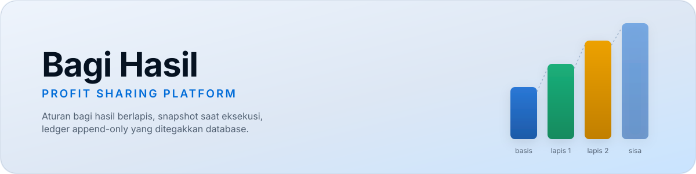
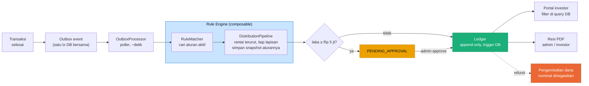

<div align="center">



<p>
  
  
  
  
  
  
  
</p>

Administrator mengatur aturan bagi hasil. Setiap transaksi yang selesai langsung didistribusikan otomatis ke investor sesuai aturan yang berlaku **saat itu**, tanpa pernah menggeser transaksi yang sudah berjalan.


</div>

**Daftar isi** · 🚀 [Menjalankan](#menjalankan) · 🗺️ [Alur data](#alur-data) · 🎬 [Demo](#demo) · ✨ [Fitur](#fitur) · 🛡️ [Yang Ada Pada Sistem](#yang-ada-pada-sistem) · 🧪 [Tes](#tes) · 📌 [Status](#status) · 🧠 [Konteks & keputusan desain](#konteks--keputusan-desain)

## Menjalankan

```bash
pnpm install
docker compose up -d postgres

cd apps/api
pnpm exec prisma migrate deploy
pnpm exec tsx prisma/seed.ts
pnpm dev                      # API  → http://localhost:4000/api

cd ../web
pnpm dev                      # Web  → http://localhost:3100
```

Buka **http://localhost:3100**, kolom login sudah terisi.

| Akun | Kata sandi | Peran |
|---|---|---|
| `admin@contoh.id` | `demo1234` | Admin keuangan, semua izin |
| `sales@contoh.id` | `demo1234` | Ops penjualan, **tanpa** izin menyetujui, kelola katalog |
| `hr@contoh.id` | `demo1234` | Admin direktori, kelola karyawan & unit organisasi |
| `investor1@contoh.id` | `demo1234` | Investor, diarahkan otomatis ke portalnya sendiri |

## Alur data

Bukan pemanggilan langsung. Event distribusi ditulis di transaksi database yang sama, lalu diambil poller. Kalau proses mati tepat setelah commit, event tetap menunggu. Tidak ada transaksi tercatat yang profitnya hilang.



## Demo

1. **Transaksi** → pilih transaksi berstatus *Draf*, klik **Selesaikan** (atau buat baru lewat **+ Transaksi baru**). Distribusi tidak dihitung langsung di sana, event masuk *outbox*, poller mengambilnya beberapa detik kemudian. Refresh, kolom "Bagi hasil" terisi.

2. **Distribusi** → buka salah satunya. Ini layar intinya. **Air terjun** yang menunjukkan laba mengalir turun lewat lapisan aturan, lengkap dengan dasar hitung tiap lapisan dan sisa setelahnya. Blok penutup selalu membuktikan `dibagikan + ditahan = laba bersih`. Tombol **Unduh resi PDF** menghasilkan bukti distribusi bervektor asli (bukan screenshot).

3. **Aturan → + Aturan baru** → panel simulasi di sebelah kanan menampilkan rantai aturan yang **sudah aktif** untuk kondisi yang Anda pilih. Ubah kategori atau nominal laba, pratinjau ikut berubah seketika.

4. **Uji izin** → keluar, masuk sebagai `sales@contoh.id`, coba setujui distribusi. Ditolak dengan `Butuh izin distribution:approve`.

5. **Refund/pengembalian dana** → masih sebagai admin, buka distribusi `SETTLED` mana pun → **Proses pengembalian dana**. Membuat pengembalian dana distribusi (nominal negatif dengan sengaja) yang menghubungkan setiap mutasi ledger tanpa menghapus riwayatnya. Transaksi asal berubah jadi `REFUNDED`.

6. **Portal investor** → keluar, masuk sebagai `investor1@contoh.id`. Diarahkan otomatis ke `/portal` (bukan shell admin). Saldo, tren, dan mutasi yang tampil **hanya** milik investor ini. Klik "kenapa segini?" pada satu mutasi untuk lihat rincian lapisan perhitungannya, lalu unduh resi PDF versi investor (cuma memuat porsinya sendiri).

7. **Direktori & Bagan** → dari akun admin/HR, buka **Direktori → Bagan**. Struktur organisasi digambar sebagai pohon dengan garis penghubung melengkung berwarna per cabang. Klik kartu mana pun untuk melihat karyawan sungguhan di unit itu.

<details>
<summary><strong>Tiga perilaku yang layak diperhatikan</strong></summary>
<br/>

- **`TRX` Elektronik** → 2 lapisan. Aturan "Dasar Semua Produk" (20% dari *sisa berjalan*) lalu "Kategori Elektronik" (30% dari *laba awal*). Dasar hitungnya berbeda, itulah kenapa setiap lapisan menuliskannya eksplisit.
- **`TRX` Server Rack** (laba > Rp 50 jt) → **1 lapisan**. Aturan "Laba Besar" bertanda `stackable = false`, sehingga menutup rantai. Perilaku *winner-takes-all* muncul dari mekanisme yang sama, bukan cabang kode terpisah.
- **Distribusi ≥ Rp 5 jt** masuk `PENDING_APPROVAL`, di bawah itu langsung `SETTLED`. Ledger baru ditulis setelah disetujui.

</details>

## Fitur

| | Fitur | Yang terjadi di balik layar | Coba di |
|---|---|---|---|
| 🌊 | Aturan bagi hasil berlapis | Beberapa aturan berlaku sekaligus, laba mengalir lewat rantai terurut, tiap lapisan menyimpan snapshot aturannya sendiri | `/aturan` |
| 🧾 | Resi PDF bervektor | `@react-pdf/renderer`, versi admin & investor, privasi terjaga per peran | tombol "Unduh resi PDF" di `/distribusi/[id]` |
| ↩️ | Pengembalian dana, bukan edit | Distribusi pengembalian dana baru (nominal negatif), ledger asli tak pernah disentuh, trigger database pun melarangnya | `/distribusi/[id]` → "Proses pengembalian dana" |
| 🔐 | RBAC + audit log | `lib/nav.ts` / `lib/permissions.tsx` satu sumber kebenaran, tiap mutasi tercatat siapa-apa-kapan | `/audit` |
| 🔁 | Idempotency-Key | Klik ganda atau retry jaringan tidak pernah menjalankan handler dua kali | header `Idempotency-Key` pada `POST /transactions`, `/profit-rules` |
| 👤 | Portal investor | Privasi ditegakkan di query database, bukan disembunyikan di UI, `404` bukan array kosong | masuk sebagai `investor1@contoh.id` |
| 🗂️ | Katalog | CRUD produk & pelanggan untuk ops penjualan | `/katalog` |
| 🧮 | Simulator mandiri | Pratinjau rantai aturan aktif tanpa perlu transaksi sungguhan | `/simulator` |
| 🏢 | Bagan organisasi | SVG, garis penghubung melengkung per cabang, klik untuk lihat karyawan sungguhan | `/direktori/bagan` |
| ⚙️ | Ambang approval | Diatur lewat layar admin, bukan di-hardcode di kode | `/pengaturan` |

## Yang Ada Pada Sistem

**Aturan berlapis (composable).** Beberapa aturan bisa berlaku bersamaan, laba mengalir melewati rantai terurut. Satu mekanisme (`stackable` + `basis`) melayani tiga kebutuhan sekaligus, yaitu aturan tunggal, komposisi berlapis, dan mode hybrid.

**Snapshot saat eksekusi.** Setiap lapisan menyimpan salinan utuh aturan pada detik distribusi terjadi. Mengubah aturan hari ini tidak menggeser sepeser pun angka transaksi kemarin. Inilah janji utama studi kasus, dan ada tes regresi yang menjaganya.

**Uang tidak pernah menyentuh `float`.** Seluruh nominal `BigInt` dalam satuan terkecil, persentase dalam *basis point*. Dijamin invarian `dibagikan + ditahan = laba bersih`, diuji terhadap 2.000 kombinasi acak nominal & persentase, tempat bug pembulatan benar-benar bersembunyi.

**Append-only ditegakkan database.** Trigger PostgreSQL menolak `UPDATE`/`DELETE` pada ledger dan lapisan distribusi, serta melarang nominal distribusi maupun isi aturan diubah. Bukan no-op senyap. Melempar exception, karena kalau ada yang mencoba mengubah ledger, sistem harus berteriak.

**Koreksi lewat pengembalian dana, bukan edit atau hapus.** Refund setelah bagi hasil cair membuat distribusi pengembalian dana baru (`reversalOfId`), bukan mengubah baris lama, trigger database melarangnya juga. Ledger tetap bisa direkonsiliasi kapan saja karena tidak ada mutasi yang pernah hilang, cuma dinegasikan secara eksplisit.

**Privasi investor ditegakkan di server, bukan disembunyikan di UI.** Endpoint `investors/me/*` menyaring data investor lain di level query database. Datanya tidak pernah meninggalkan database, jadi tidak bisa bocor lewat devtools sekalipun. Meminta distribusi milik investor lain mengembalikan `404`, bukan array kosong (array kosong pun sudah membocorkan bahwa distribusinya ada). Identitas investor selalu diturunkan dari `sub` di JWT, tidak pernah dari parameter URL.

**Satu sumber kebenaran untuk navigasi & izin.** `lib/nav.ts` dan `lib/permissions.tsx` di frontend adalah satu-satunya tempat aturan "siapa boleh lihat apa" didefinisikan, dipakai baik oleh halaman login (menentukan tujuan pertama) maupun shell admin (render sidebar + jaga halaman).

**Idempotency-Key di endpoint yang mengubah uang.** `POST /transactions` dan `POST /profit-rules` menerima header `Idempotency-Key`. Permintaan kedua dengan key yang sama mengembalikan hasil pertama tanpa menjalankan handler lagi, jadi klik ganda atau retry jaringan tidak pernah membuat efek dua kali.

## Tes

```bash
cd apps/api && pnpm exec vitest run
```

15 tes pada logika domain, berjalan tanpa database, tanpa framework.

## Status

**Sudah jalan**, fondasi, skema, pipeline bagi hasil, outbox, auth + RBAC, approval, ledger, reversal/refund, Idempotency-Key, audit log, pengaturan ambang approval, layar admin lengkap (dashboard, transaksi + form transaksi baru, katalog, aturan + linimasa riwayat versi, simulator mandiri, distribusi, investor, direktori karyawan + bagan organisasi interaktif), portal investor penuh (ringkasan, tren, mutasi, *explain* per distribusi), resi PDF (versi admin & investor, privasi terjaga per peran), dan tema visual "Skyline" (redesign penuh dari draf tema gelap awal, disesuaikan lewat putaran umpan balik pengguna asli).

**Belum**, pencairan periodik (`PayoutBatch` sudah ada di skema), sinkronisasi IdP, dan deployment.

> Sistem ini sempat diaudit terhadap studi kasus & spesifikasi UX aslinya dan ditemukan 8 kesenjangan nyata (form transaksi tidak ada, reversal tidak ada, dan seterusnya), semuanya sudah ditutup. Detail lengkapnya ada di bagian berikut.

## Konteks & keputusan desain

<details>
<summary><strong>Latar Belakang</strong></summary>
<br/>

Studi kasus aslinya cuma satu paragraf. Administrator mengatur aturan bagi hasil, transaksi yang selesai didistribusikan otomatis ke investor. Yang tidak dijawab studi kasus, dan jadi pekerjaan desain sesungguhnya, adalah lima pertanyaan implisit. Apa yang terjadi kalau beberapa aturan berlaku sekaligus di transaksi yang sama? Bagaimana kalau aturan berubah setelah transaksi lama sudah didistribusikan? Uang dihitung dari basis apa saat ada rantai aturan? Siapa yang boleh melihat distribusi siapa? Dan bagaimana meralat distribusi yang sudah cair tanpa berbohong soal riwayatnya?

Jawaban atas kelima pertanyaan itulah yang membentuk rule engine composable, snapshot-at-execution, dan mekanisme reversal di atas, bukan fitur tambahan, tapi jawaban langsung terhadap celah di spesifikasi awal.

</details>

<details>
<summary><strong>Bottleneck yang Diselesaikan</strong></summary>
<br/>

- **Kolom unik yang diam-diam memblokir pengembalian dana.** `transactionId` di tabel distribusi awalnya `@unique` penuh, secara struktural mustahil punya dua baris distribusi (asli + pengembalian dana) untuk satu transaksi yang sama. Bukan soal kehabisan waktu, konflik skemanya baru kelihatan begitu ada yang benar-benar mencoba menulis kode pengembalian dana. Diperbaiki dengan *partial unique index* (`WHERE reversal_of_id IS NULL`).
- **Race condition di interceptor idempotency.** Versi pertama menandai key sebagai selesai lewat efek samping `tap()` RxJS yang tidak ditunggu, respons HTTP bisa balik ke klien sebelum tulisan ke database selesai, jadi request kedua yang datang cepat melihat status basi dan ditolak salah. Ketahuan lewat dua `curl` beruntun dengan `Idempotency-Key` yang sama, bukan dari membaca kode. Diperbaiki dengan mengganti `tap` jadi `switchMap` yang benar-benar menunggu tulisan database sebelum mengembalikan respons.
- **Bagan organisasi, tujuh putaran desain.** Dari daftar bertingkat → tabel CSS → reposisi geometris manual → penulisan ulang penuh berbasis SVG. Dua di antaranya bug CSS/browser yang jarang diketahui. `overflow-x: auto` diam-diam memaksa `overflow-y` ikut *scrollable* plus *scroll-anchoring* yang menggeser posisi scroll sendiri, dan `display: inline-block` yang ternyata tidak center otomatis meski parent-nya `text-align: center`.

</details>

<details>
<summary><strong>Pertimbangan Scope Sistem</strong></summary>
<br/>

Beberapa hal sengaja dipangkas karena aman untuk dipangkas, bukan karena kehabisan waktu di ujung. Pencairan periodik dibiarkan sebagai skema siap pakai (`PayoutBatch`) tanpa job scheduler-nya, sinkronisasi identitas eksternal (IdP) diganti auth lokal karena skala studi kasus tidak membutuhkannya, dan deployment production ditinggalkan demi memastikan lima hal yang **tidak boleh dipangkas** benar-benar solid, yaitu kebenaran uang, immutability riwayat, privasi investor, RBAC, dan audit trail.

</details>

