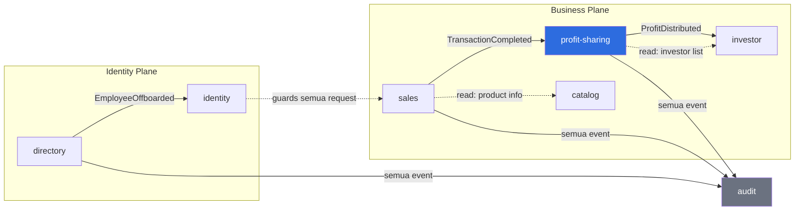
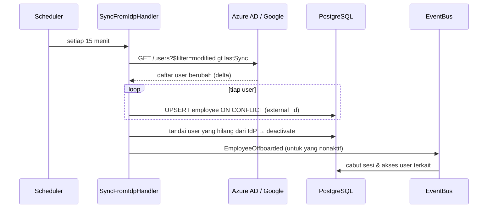
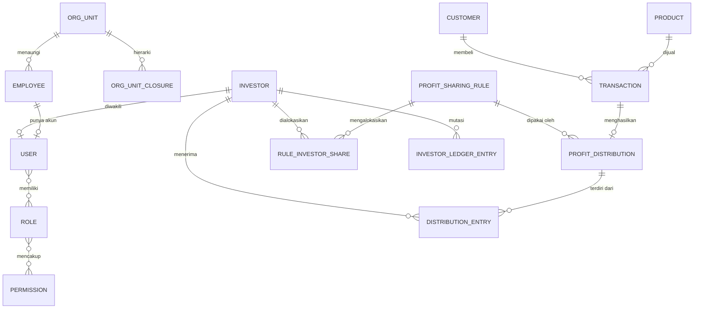
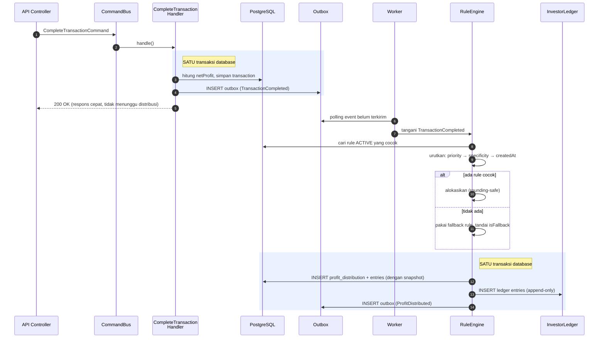

# Software Architecture — Dynamic Profit-Sharing & Directory Management System

> Dokumen ini merancang arsitektur teknis untuk studi kasus di [`study-case.md`](./study-case.md), diperluas dengan kebutuhan **Directory Management** (identitas karyawan terpusat, SSO, hierarki organisasi, sinkronisasi otomatis) dan penerapan **pola CRUD tingkat lanjut** (soft delete, CQRS, event sourcing, idempotency, upsert).
>
> **Status: seluruh open question sudah dijawab** ([`open-q.md`](./open-q.md)). Dokumen ini sudah disesuaikan dengan keputusan final — tidak ada lagi asumsi menggantung.

## Keputusan Final yang Membentuk Arsitektur

| Keputusan | Dampak arsitektur |
|---|---|
| **Rule composable berlapis** (A1) | Rule engine jadi *pipeline*, bukan *selector*. Butuh entitas `DistributionLayer` + pagar pengaman over-allocation. **Perubahan terbesar dari draf awal.** |
| Total ≤ 100%, sisa ke perusahaan (A2, A7) | Kolom `retained_by_company` pada distribusi; perusahaan jadi penerima residual, bukan entitas investor |
| Fallback + penanda tinjauan (A3) | `is_fallback` + antrean tinjauan di dashboard |
| Approval berbasis ambang batas (A5) | Status distribusi bertambah `PENDING_APPROVAL`; butuh layar antrean persetujuan |
| Ledger real-time, payout periodik (A6) | Entitas `PayoutBatch` + `PayoutItem` terpisah dari ledger |
| Hybrid IdP, SSO menyusul (B1, B2) | Modul identity dengan abstraksi strategy; connector IdP di-*stub* untuk MVP |
| Event sourcing selektif (C1) | Hanya ledger & distribusi yang *append-only* |
| Fullstack + deployment, **40 jam** (D1, D3) | Ruang lingkup dipangkas agresif — lihat [bagian 15](#15-roadmap-implementasi--anggaran-40-jam) |
| < 200rb transaksi/hari (D4) | Modular monolith cukup; tapi ledger perlu strategi partisi sejak awal |

---

## Daftar Isi

1. [Prinsip Arsitektur](#1-prinsip-arsitektur)
2. [Pemilihan Framework & Stack](#2-pemilihan-framework--stack)
3. [Gaya Arsitektur: Modular Monolith](#3-gaya-arsitektur-modular-monolith)
4. [Bounded Context & Peta Modul](#4-bounded-context--peta-modul)
5. [Layering di Dalam Modul](#5-layering-di-dalam-modul)
6. [Directory Management (Struktur Folder)](#6-directory-management-struktur-folder)
7. [Modul Identity & Directory Service](#7-modul-identity--directory-service)
8. [Penerapan Pola CRUD Tingkat Lanjut](#8-penerapan-pola-crud-tingkat-lanjut)
9. [Desain Data & Skema Database](#9-desain-data--skema-database)
10. [Alur Eksekusi Utama](#10-alur-eksekusi-utama)
11. [Desain API](#11-desain-api)
12. [Cross-Cutting Concerns](#12-cross-cutting-concerns)
13. [Strategi Testing](#13-strategi-testing)
14. [Jalur Scaling & Deployment](#14-jalur-scaling--deployment)
15. [Roadmap Implementasi](#15-roadmap-implementasi)

---

## 1. Prinsip Arsitektur

Lima prinsip yang menjadi dasar setiap keputusan di dokumen ini:

| # | Prinsip | Implikasi konkret |
|---|---|---|
| 1 | **Snapshot at execution time** | Hasil distribusi profit tidak pernah bergantung pada state rule yang bisa berubah di masa depan. Rule bersifat *versioned*, distribusi menyimpan salinan persentase yang dipakai. |
| 2 | **Uang tidak pernah di-UPDATE atau DELETE** | Semua koreksi finansial dilakukan lewat entri pembalik (*reversal*), bukan mengubah baris lama. Prinsip akuntansi *double-entry*. |
| 3 | **Modul dulu, layanan kemudian** | Batas modul ditegakkan sejak awal (bukan microservice sejak awal). Memecah monolith yang batasnya rapi itu mudah; menyatukan microservice yang batasnya bocor itu mimpi buruk. |
| 4 | **Kompleksitas dibayar hanya di tempat yang membutuhkannya** | Event sourcing & CQRS diterapkan **selektif** — di ledger keuangan, bukan di CRUD produk. Menerapkan pola canggih secara merata adalah bentuk lain dari *over-engineering*. |
| 5 | **Identitas datang dari satu sumber** | Satu tempat untuk data karyawan, satu jalur autentikasi. Menonaktifkan akun di satu tempat harus langsung memutus seluruh akses. |

### Anti-goal (yang sengaja TIDAK dikejar)

- ❌ Microservices sejak hari pertama — beban operasional tidak sebanding untuk skala di studi kasus.
- ❌ Full event sourcing di semua entitas — lihat prinsip #4.
- ❌ *Physical CQRS* dengan database read terpisah di MVP — *eventual consistency* pada saldo investor adalah risiko bisnis, bukan sekadar detail teknis.
- ❌ Abstraksi database generik (*repository* untuk semua hal) — biarkan query kompleks tetap eksplisit dan bisa dibaca.

---

## 2. Pemilihan Framework & Stack

### 2.1 Perbandingan Kandidat

Empat kandidat serius, dinilai terhadap kebutuhan spesifik studi kasus ini (rule engine, event-driven, presisi finansial, integrasi identitas):

| Kriteria | **NestJS** (Node/TS) | **Laravel** (PHP) | **Spring Boot** (Java) | **Next.js fullstack** |
|---|---|---|---|---|
| Modularitas & DI bawaan | ⭐⭐⭐⭐⭐ modul + DI kelas satu | ⭐⭐⭐ service provider | ⭐⭐⭐⭐⭐ sangat matang | ⭐⭐ tidak ada konsep modul backend |
| Dukungan CQRS/Event bawaan | ⭐⭐⭐⭐⭐ `@nestjs/cqrs` + `EventEmitter` | ⭐⭐⭐⭐ Events & Listeners | ⭐⭐⭐⭐ Spring Events / Axon | ⭐ harus dirakit sendiri |
| Integrasi SSO/OIDC | ⭐⭐⭐⭐⭐ Passport strategies | ⭐⭐⭐⭐ Socialite / Saml2 | ⭐⭐⭐⭐⭐ Spring Security | ⭐⭐⭐⭐ NextAuth/Auth.js |
| Type-safety untuk rule engine | ⭐⭐⭐⭐⭐ TypeScript ketat | ⭐⭐⭐ PHP types terbatas | ⭐⭐⭐⭐⭐ | ⭐⭐⭐⭐⭐ |
| Kecepatan development | ⭐⭐⭐⭐ | ⭐⭐⭐⭐⭐ paling cepat | ⭐⭐ boilerplate berat | ⭐⭐⭐⭐⭐ |
| Cocok untuk logika finansial | ⭐⭐⭐⭐ (perlu disiplin: `BigInt`/`decimal.js`) | ⭐⭐⭐⭐ (`bcmath`) | ⭐⭐⭐⭐⭐ (`BigDecimal`) | ⭐⭐⭐ |
| Berbagi tipe dengan frontend | ⭐⭐⭐⭐⭐ satu bahasa | ⭐⭐ | ⭐⭐ | ⭐⭐⭐⭐⭐ |

### 2.2 Keputusan: NestJS + PostgreSQL + Prisma

> Stack dibebaskan oleh pemberi test (D2), jadi rekomendasi ini yang dipakai. Kalaupun kelak stack diganti, arsitektur logis di dokumen ini tetap berlaku — hanya pemetaan sintaksisnya yang berubah.

**Alasan utama, bukan sekadar popularitas:**

1. **Rule engine butuh type-safety.** Kondisi rule (`product_category`, `min_profit`, `date_range`) dan hasil evaluasinya adalah tempat di mana bug diam-diam paling mahal. *Discriminated union* dan *exhaustive check* di TypeScript menangkap kelas kesalahan ini pada waktu kompilasi, bukan saat uang sudah salah terbagi.
2. **Struktur modul NestJS memaksa batas yang eksplisit.** `@Module({ imports, providers, exports })` membuat kebocoran antar-bounded-context terlihat kasat mata di *code review* — sesuatu yang di framework lain harus dijaga lewat konvensi saja.
3. **CQRS & event bus tersedia native.** `@nestjs/cqrs` menyediakan `CommandBus`, `QueryBus`, dan `EventBus` sebagai infrastruktur bawaan. Ini persis pola yang dibutuhkan di bagian 8, tanpa merakit sendiri.
4. **Satu bahasa untuk API, worker, dan dashboard.** Tipe kontrak (DTO) dibagi lewat package `@repo/contracts`, sehingga perubahan bentuk response langsung memunculkan error kompilasi di frontend — bukan bug runtime yang ditemukan pengguna.
5. **Prisma untuk migrasi + query type-safe**, dengan pintu keluar ke *raw SQL* saat query rule-matching butuh optimasi manual.

### 2.3 Stack Lengkap

```
┌─ Bahasa & Runtime ──────────────────────────────────────────┐
│  TypeScript 5.x (strict) · Node.js 24 LTS                   │
├─ Backend ───────────────────────────────────────────────────┤
│  NestJS 11        — framework aplikasi & modularitas        │
│  @nestjs/cqrs     — Command/Query/Event bus                 │
│  @nestjs/schedule — poller outbox & job payout periodik      │
│  Prisma 6         — ORM, migrasi, type-safe query           │
│  Zod              — validasi runtime + inferensi tipe        │
│  Passport         — abstraksi autentikasi (JWT / OIDC)      │
├─ Database ──────────────────────────────────────────────────┤
│  PostgreSQL 17    — DB utama, outbox, idempotency store     │
├─ Frontend ──────────────────────────────────────────────────┤
│  Next.js 16 (App Router) · shadcn/ui · TanStack Query       │
├─ Kualitas & Operasional ────────────────────────────────────┤
│  Vitest · Testcontainers · Pino · Turborepo                 │
└─────────────────────────────────────────────────────────────┘
```

**Redis & BullMQ sengaja dikeluarkan dari MVP.** Ini keputusan sadar yang didorong anggaran 40 jam, dan cocok dengan prinsip "risiko rendah, imbalan tinggi" yang Anda minta diterapkan lebih luas:

- **Outbox** cukup di-*poll* dari tabel PostgreSQL oleh `@nestjs/schedule` (`SELECT … FOR UPDATE SKIP LOCKED`) — aman untuk multi-instance, tanpa broker tambahan.
- **Idempotency store** cukup satu tabel PostgreSQL dengan indeks TTL.
- **Cache** belum dibutuhkan pada < 200rb transaksi/hari.

Efeknya: infrastruktur produksi menyusut jadi **satu database + dua service**, sehingga deployment (yang masuk deliverable) benar-benar selesai dalam waktu yang tersedia. `SKIP LOCKED` memberi semantik antrean yang cukup kuat sampai beban benar-benar menuntut broker sungguhan — dan saat itu tiba, yang berubah hanya implementasi `EventBus`.

**Yang juga sengaja tidak dipakai:** `decimal.js`. Karena mata uang tunggal IDR dan seluruh nominal disimpan sebagai integer satuan terkecil (A8), aritmatika `BigInt` bawaan JavaScript sudah eksak — menambah pustaka desimal justru membuka celah konversi yang tidak perlu.

**Kenapa PostgreSQL, bukan MySQL/MongoDB:**
- `NUMERIC`/`BIGINT` presisi eksak untuk uang.
- **Partial index** — `WHERE deleted_at IS NULL` bisa diindeks langsung, menghapus biaya utama soft delete (lihat 8.1).
- **`ltree`** — tipe data asli untuk hierarki organisasi (lihat 7.3).
- **`JSONB`** — menyimpan kondisi rule yang bentuknya bisa berkembang, tanpa migrasi skema tiap kali admin butuh kriteria baru.
- **Transaksi ACID sungguhan** — tidak bisa ditawar untuk sistem yang membagi uang.

---

## 3. Gaya Arsitektur: Modular Monolith

```
┌──────────────────────────────────────────────────────────────────┐
│                        API Gateway (NestJS)                      │
│         Auth Guard · Rate Limit · Idempotency · Logging          │
└───────────────────────────────┬──────────────────────────────────┘
                                │
   ┌────────────┬───────────────┼───────────────┬─────────────┐
   │            │               │               │             │
┌──▼───────┐ ┌──▼─────────┐ ┌───▼──────────┐ ┌──▼─────────┐ ┌─▼────────┐
│ Identity │ │  Catalog   │ │    Sales     │ │   Profit   │ │  Ledger  │
│    &     │ │  (Product) │ │(Transaction) │ │  Sharing   │ │(Investor)│
│Directory │ │            │ │              │ │(Rule Engine│ │          │
└──────────┘ └────────────┘ └──────┬───────┘ └─────┬──────┘ └────▲─────┘
                                   │               │             │
                                   │  domain       │  domain     │
                                   │  event        │  event      │
                                   └──────────►────┴──────►──────┘
                              TransactionCompleted   ProfitDistributed

┌──────────────────────────────────────────────────────────────────┐
│      Shared Kernel — Money · Result · Clock · DomainEvent        │
├──────────────────────────────────────────────────────────────────┤
│  Infrastructure — PostgreSQL · Redis · BullMQ · Object Storage   │
└──────────────────────────────────────────────────────────────────┘
```

### 3.1 Kenapa Modular Monolith, bukan Microservices

Studi kasus ini melibatkan **transaksi finansial yang harus konsisten**. Distribusi profit dan pencatatan ledger idealnya berada dalam satu batas transaksional. Memecahnya jadi microservice sejak awal memaksa penggunaan *saga* / *distributed transaction* — kompleksitas besar yang belum dibutuhkan.

Modular monolith memberi:
- **Satu transaksi database** untuk operasi yang harus atomik.
- **Deployment sederhana** — satu artefak, satu pipeline.
- **Batas modul tetap tegas**, sehingga pemisahan di kemudian hari (misal `Identity` jadi service sendiri saat SSO dipakai lintas aplikasi) tinggal memindahkan folder.

### 3.2 Aturan Komunikasi Antar Modul

Tiga aturan yang ditegakkan lewat linter (`eslint-plugin-boundaries`), bukan sekadar kesepakatan lisan:

| Aturan | Penjelasan |
|---|---|
| **1. Dilarang impor lintas modul secara internal** | `sales/**` tidak boleh mengimpor `profit-sharing/domain/**`. Hanya `*/public-api.ts` yang boleh dilintasi. |
| **2. Komunikasi state-changing lewat domain event** | `Sales` tidak memanggil `ProfitSharing` secara langsung. Ia menerbitkan `TransactionCompleted`; `ProfitSharing` yang mendengarkan. |
| **3. Query lintas modul lewat public API tersinkron** | Untuk sekadar membaca (misal `Sales` butuh nama produk), boleh memanggil `CatalogPublicApi` — antarmuka baca yang sempit dan stabil. |

```ts
// ❌ DILARANG — menembus internal modul lain
import { ProfitSharingRuleEntity } from '../../profit-sharing/domain/entities/rule.entity';

// ✅ BENAR — lewat kontrak publik
import { CatalogPublicApi } from '@modules/catalog/public-api';

// ✅ BENAR — perubahan state lewat event
this.eventBus.publish(new TransactionCompletedEvent(transaction.id));
```

Dampak praktisnya: ketika suatu saat `ProfitSharing` perlu dipisah jadi service tersendiri, satu-satunya yang berubah adalah implementasi `EventBus` (dari in-process menjadi RabbitMQ/Kafka). Kode domainnya tidak tersentuh sama sekali.

---

## 4. Bounded Context & Peta Modul

| Modul | Tanggung Jawab | Menerbitkan Event | Mendengarkan Event |
|---|---|---|---|
| **identity** | User, kredensial, sesi, role & permission, SSO/OIDC | `UserDeactivated` | `EmployeeOffboarded` |
| **directory** | Karyawan, unit organisasi, hierarki, sinkronisasi IdP | `EmployeeCreated`, `EmployeeOffboarded` | — |
| **catalog** | Produk, kategori, harga, biaya produksi | `ProductPriceChanged` | — |
| **sales** | Transaksi, pelanggan, perhitungan net profit | `TransactionCompleted`, `TransactionRefunded` | — |
| **profit-sharing** | Rule engine, matching, kalkulasi distribusi | `ProfitDistributed`, `DistributionFailed` | `TransactionCompleted`, `TransactionRefunded` |
| **investor** | Profil investor, ledger saldo, riwayat payout | — | `ProfitDistributed` |
| **audit** | Jejak audit lintas modul, log perubahan | — | `*` (semua event) |

### Diagram Konteks



Garis putus-putus = pembacaan sinkron lewat public API. Garis penuh = domain event asinkron.

---

## 5. Layering di Dalam Modul

Setiap modul bisnis memakai **empat lapisan** dengan aturan ketergantungan searah ke dalam (*dependency rule* ala Clean Architecture):

```
presentation  →  application  →  domain  ←  infrastructure
   (HTTP)         (use case)     (aturan)    (implementasi)
```

| Lapisan | Isi | Boleh bergantung pada |
|---|---|---|
| **domain** | Entity, value object, aturan bisnis murni, *interface* repository | Tidak ada apa-apa (murni TypeScript) |
| **application** | Command/Query handler, orkestrasi use case, DTO | `domain` |
| **infrastructure** | Implementasi repository (Prisma), klien HTTP, adapter | `domain`, `application` |
| **presentation** | Controller, validasi request, serialisasi response | `application` |

**Kunci desainnya:** `domain` tidak mengimpor apa pun dari NestJS maupun Prisma. Kelas `ProfitSharingRule` dan algoritma pembagiannya bisa diuji tanpa menyalakan database sama sekali — dan inilah bagian yang paling wajib diuji karena menyangkut uang.

```ts
// domain/services/profit-allocator.ts — nol dependensi framework
export class ProfitAllocator {
  allocate(netProfit: Money, shares: InvestorShare[]): AllocationResult {
    // aritmatika murni + jaminan: jumlah seluruh alokasi == netProfit
  }
}
```

---

## 6. Directory Management (Struktur Folder)

Bagian ini menjawab kebutuhan **"directory management agar scalable"**. Prinsipnya: **struktur folder mencerminkan batas bisnis, bukan jenis file teknis.**

### 6.1 Kenapa bukan struktur "by type"

Banyak proyek memakai `controllers/`, `services/`, `models/` di level teratas. Struktur ini terlihat rapi saat file masih sedikit, tapi tidak *scalable* karena:

- Menambah satu fitur berarti menyentuh 5 folder berbeda yang berjauhan.
- Batas modul tidak terlihat — tidak ada yang mencegah `TransactionService` mengimpor `RuleRepository` secara diam-diam.
- Memisahkan satu bagian jadi service terpisah berarti membedah setiap folder satu per satu.

Struktur **by-feature (bounded context)** membuat setiap modul jadi unit yang bisa dipindahkan utuh.

### 6.2 Struktur Level Atas (Monorepo)

```
technical-test/
├── apps/
│   ├── api/                       # NestJS — REST API + event handler
│   ├── worker/                    # Consumer BullMQ (distribusi, sinkronisasi IdP)
│   └── web/                       # Next.js — dashboard admin & portal investor
│
├── packages/
│   ├── contracts/                 # DTO & tipe bersama API ↔ Web (sumber kebenaran tunggal)
│   ├── config/                    # Konfigurasi eslint/tsconfig/prettier bersama
│   ├── domain-kernel/             # Money, Result, DomainEvent, Clock — dipakai lintas app
│   └── ui/                        # Komponen React bersama (kalau ada >1 frontend)
│
├── docs/
│   ├── study-case.md
│   ├── architecture.md
│   ├── open-q.md
│   ├── adr/                       # Architecture Decision Records
│   │   ├── 0001-modular-monolith.md
│   │   ├── 0002-rule-versioning-strategy.md
│   │   └── 0003-money-as-bigint.md
│   └── diagrams/
│
├── docker/
│   ├── docker-compose.yml         # postgres + redis untuk pengembangan lokal
│   └── Dockerfile.api
│
├── turbo.json
├── package.json
└── README.md
```

**Kenapa monorepo (Turborepo):** `packages/contracts` menjadi satu-satunya sumber kebenaran bentuk data. Saat field `netProfit` berubah tipe, `apps/web` gagal *build* seketika — bukan menampilkan `NaN` ke pengguna di produksi.

### 6.3 Struktur `apps/api` (inti sistem)

```
apps/api/
├── src/
│   ├── main.ts
│   ├── app.module.ts
│   │
│   ├── modules/                          # ◀── satu folder = satu bounded context
│   │   │
│   │   ├── identity/
│   │   │   ├── identity.module.ts
│   │   │   ├── public-api.ts             # ◀── SATU-SATUNYA pintu keluar modul
│   │   │   ├── domain/
│   │   │   │   ├── entities/
│   │   │   │   │   ├── user.entity.ts
│   │   │   │   │   ├── role.entity.ts
│   │   │   │   │   └── permission.entity.ts
│   │   │   │   ├── value-objects/
│   │   │   │   │   ├── email.vo.ts
│   │   │   │   │   └── password-hash.vo.ts
│   │   │   │   ├── events/
│   │   │   │   │   └── user-deactivated.event.ts
│   │   │   │   └── repositories/         # interface saja, tanpa implementasi
│   │   │   │       └── user.repository.ts
│   │   │   ├── application/
│   │   │   │   ├── commands/
│   │   │   │   │   ├── login/
│   │   │   │   │   │   ├── login.command.ts
│   │   │   │   │   │   └── login.handler.ts
│   │   │   │   │   └── deactivate-user/
│   │   │   │   ├── queries/
│   │   │   │   │   └── get-current-user/
│   │   │   │   └── event-handlers/
│   │   │   │       └── on-employee-offboarded.handler.ts
│   │   │   ├── infrastructure/
│   │   │   │   ├── persistence/
│   │   │   │   │   └── prisma-user.repository.ts
│   │   │   │   ├── auth/
│   │   │   │   │   ├── jwt.strategy.ts
│   │   │   │   │   ├── oidc.strategy.ts        # SSO — disiapkan, diaktifkan pasca-MVP (B2)
│   │   │   │   │   └── password-hasher.ts
│   │   │   │   └── guards/
│   │   │   │       ├── jwt-auth.guard.ts
│   │   │   │       └── permissions.guard.ts
│   │   │   └── presentation/
│   │   │       ├── auth.controller.ts
│   │   │       └── dto/
│   │   │
│   │   ├── directory/                    # ◀── Directory Service (bagian 7)
│   │   │   ├── directory.module.ts
│   │   │   ├── public-api.ts
│   │   │   ├── domain/
│   │   │   │   ├── entities/
│   │   │   │   │   ├── employee.entity.ts
│   │   │   │   │   ├── org-unit.entity.ts
│   │   │   │   │   └── position.entity.ts
│   │   │   │   ├── services/
│   │   │   │   │   └── org-hierarchy.service.ts     # traversal pohon organisasi
│   │   │   │   └── events/
│   │   │   │       ├── employee-created.event.ts
│   │   │   │       └── employee-offboarded.event.ts
│   │   │   ├── application/
│   │   │   │   ├── commands/
│   │   │   │   │   ├── create-employee/
│   │   │   │   │   ├── move-employee-to-unit/
│   │   │   │   │   └── sync-from-idp/               # upsert massal (bagian 8.5)
│   │   │   │   └── queries/
│   │   │   │       ├── get-org-chart/
│   │   │   │       ├── search-employees/
│   │   │   │       └── get-direct-reports/
│   │   │   ├── infrastructure/
│   │   │   │   ├── persistence/
│   │   │   │   ├── idp-connectors/                  # Sinkronisasi Otomatis
│   │   │   │   │   ├── idp-connector.interface.ts
│   │   │   │   │   ├── azure-ad.connector.ts
│   │   │   │   │   ├── google-workspace.connector.ts
│   │   │   │   │   └── scim.connector.ts
│   │   │   │   └── storage/
│   │   │   │       └── employee-photo.storage.ts
│   │   │   └── presentation/
│   │   │       ├── employee.controller.ts
│   │   │       ├── org-chart.controller.ts
│   │   │       └── scim.controller.ts               # endpoint SCIM 2.0
│   │   │
│   │   ├── catalog/
│   │   │   └── … (pola yang sama)
│   │   │
│   │   ├── sales/
│   │   │   ├── domain/
│   │   │   │   ├── entities/
│   │   │   │   │   ├── transaction.entity.ts
│   │   │   │   │   └── customer.entity.ts
│   │   │   │   ├── services/
│   │   │   │   │   └── net-profit-calculator.ts     # revenue − cost
│   │   │   │   └── events/
│   │   │   │       └── transaction-completed.event.ts
│   │   │   └── …
│   │   │
│   │   ├── profit-sharing/               # ◀── INTI STUDI KASUS
│   │   │   ├── profit-sharing.module.ts
│   │   │   ├── public-api.ts
│   │   │   ├── domain/
│   │   │   │   ├── entities/
│   │   │   │   │   ├── profit-sharing-rule.entity.ts
│   │   │   │   │   ├── rule-investor-share.entity.ts
│   │   │   │   │   └── profit-distribution.entity.ts
│   │   │   │   ├── value-objects/
│   │   │   │   │   ├── rule-condition.vo.ts
│   │   │   │   │   ├── percentage.vo.ts
│   │   │   │   │   └── effective-period.vo.ts
│   │   │   │   ├── services/                        # ◀── jantung rule engine
│   │   │   │   │   ├── rule-matcher.service.ts      # cari kandidat rule
│   │   │   │   │   ├── rule-resolver.service.ts     # prioritas & spesifisitas
│   │   │   │   │   ├── profit-allocator.service.ts  # bagi + rounding-safe
│   │   │   │   │   └── specificity-scorer.ts
│   │   │   │   ├── policies/
│   │   │   │   │   ├── rounding.policy.ts           # sisa pembulatan → perusahaan (A7)
│   │   │   │   │   └── fallback-rule.policy.ts      # default rule + penanda tinjauan (A3)
│   │   │   │   └── events/
│   │   │   ├── application/
│   │   │   │   ├── commands/
│   │   │   │   │   ├── create-rule/
│   │   │   │   │   ├── supersede-rule/              # versioning, bukan update
│   │   │   │   │   ├── distribute-profit/
│   │   │   │   │   └── reverse-distribution/
│   │   │   │   ├── queries/
│   │   │   │   │   ├── simulate-distribution/       # dry-run untuk admin
│   │   │   │   │   ├── get-active-rules/
│   │   │   │   │   └── explain-distribution/        # "kenapa dapat segini?"
│   │   │   │   └── event-handlers/
│   │   │   │       └── on-transaction-completed.handler.ts
│   │   │   ├── infrastructure/
│   │   │   └── presentation/
│   │   │
│   │   ├── investor/
│   │   │   ├── domain/
│   │   │   │   ├── entities/
│   │   │   │   │   ├── investor.entity.ts
│   │   │   │   │   └── ledger-entry.entity.ts       # append-only
│   │   │   │   └── services/
│   │   │   │       └── balance-calculator.ts        # dari ledger, bukan kolom saldo
│   │   │   └── …
│   │   │
│   │   └── audit/
│   │       └── …
│   │
│   ├── shared/                           # ◀── Shared Kernel (dipakai semua modul)
│   │   ├── domain/
│   │   │   ├── money.vo.ts               # BIGINT, tidak pernah float
│   │   │   ├── result.ts                 # Result<T, E> — error eksplisit
│   │   │   ├── domain-event.base.ts
│   │   │   ├── aggregate-root.base.ts
│   │   │   └── soft-deletable.mixin.ts
│   │   ├── decorators/
│   │   │   ├── idempotent.decorator.ts   # bagian 8.4
│   │   │   ├── require-permission.decorator.ts
│   │   │   └── current-user.decorator.ts
│   │   ├── filters/
│   │   │   └── domain-exception.filter.ts
│   │   ├── interceptors/
│   │   │   ├── logging.interceptor.ts
│   │   │   └── transaction.interceptor.ts
│   │   └── utils/
│   │
│   ├── infrastructure/                   # ◀── teknis, lintas modul
│   │   ├── database/
│   │   │   ├── prisma.service.ts
│   │   │   └── transaction-manager.ts    # Unit of Work
│   │   ├── cache/
│   │   ├── queue/
│   │   ├── event-bus/
│   │   │   ├── in-process.bus.ts         # sekarang
│   │   │   └── outbox.publisher.ts       # transactional outbox (bagian 10.2)
│   │   └── observability/
│   │
│   └── config/
│       ├── app.config.ts
│       ├── database.config.ts
│       └── env.validation.ts             # validasi env pakai Zod saat boot
│
├── prisma/
│   ├── schema.prisma
│   ├── migrations/
│   └── seed.ts
│
└── test/
    ├── unit/
    ├── integration/
    └── e2e/
```

### 6.4 Aturan Penamaan & Konvensi

| Elemen | Konvensi | Contoh |
|---|---|---|
| Folder | `kebab-case` | `profit-sharing/` |
| File | `kebab-case.<peran>.ts` | `rule-matcher.service.ts` |
| Kelas | `PascalCase` + akhiran peran | `RuleMatcherService` |
| Command/Query | satu folder per use case | `distribute-profit/{command,handler}.ts` |
| Event | kata kerja lampau | `transaction-completed.event.ts` |
| Tabel database | `snake_case` jamak | `profit_sharing_rules` |

**Aturan "satu folder per use case"** patut disorot. Alih-alih satu file `ProfitSharingService` raksasa berisi 20 method, setiap use case punya foldernya sendiri berisi command + handler + test. Efeknya: konflik *merge* nyaris hilang saat beberapa orang bekerja paralel, dan setiap file tetap muat dibaca dalam satu layar.

### 6.5 Menegakkan Batas Modul Secara Otomatis

```jsonc
// .eslintrc — boundaries antar modul, ditegakkan mesin bukan niat baik
{
  "settings": {
    "boundaries/elements": [
      { "type": "module-internal", "pattern": "src/modules/*/((domain|application|infrastructure|presentation))/**" },
      { "type": "module-public",   "pattern": "src/modules/*/public-api.ts" },
      { "type": "shared",          "pattern": "src/shared/**" }
    ]
  },
  "rules": {
    "boundaries/element-types": ["error", {
      "default": "disallow",
      "rules": [
        { "from": "module-internal", "allow": ["module-public", "shared"] },
        { "from": "module-internal", "allow": ["module-internal"],
          "importKind": "value", "message": "Hanya boleh dalam modul yang sama" }
      ]
    }]
  }
}
```

Tanpa penegakan otomatis, batas modul akan luruh dalam hitungan minggu. Ini yang membedakan modular monolith dari "monolith biasa yang foldernya rapi".

---

## 7. Modul Identity & Directory Service

Memetakan empat kebutuhan directory management ke desain konkret:

| Kebutuhan Anda | Implementasi |
|---|---|
| Penyimpanan Data Terpusat | Entitas `Employee` sebagai sumber tunggal (nama, jabatan, email, telepon, foto) |
| Kontrol Akses (SSO) | Modul `identity` dengan Passport OIDC/SAML + RBAC |
| Manajemen Hierarki | `OrgUnit` + closure table / `ltree` + reporting line |
| Sinkronisasi Otomatis | Connector SCIM 2.0 + job berkala, dengan **upsert** massal |

### 7.1 Pemisahan `User`, `Employee`, dan `Investor`

Keputusan desain yang penting dan sering dilewatkan:

```
User      → identitas untuk login (email, kredensial, sesi, role)
Employee  → entitas HR (nama, jabatan, telepon, foto, unit organisasi, atasan)
Investor  → entitas bisnis penerima bagi hasil
```

Ketiganya **tabel terpisah** dengan relasi opsional. Alasannya:
- Ada karyawan yang tidak butuh akun login (staf lapangan).
- Ada user yang bukan karyawan (investor eksternal, akun sistem/integrasi).
- Investor bisa berupa badan hukum yang diwakili beberapa user.

Menggabungkan ketiganya jadi satu tabel `users` dengan kolom `type` terasa lebih sederhana di minggu pertama, lalu berubah jadi tabel penuh kolom bernilai `NULL` dan validasi kondisional di bulan ketiga.

### 7.2 Autentikasi & Otorisasi

```
┌──────────────────────────────────────────────────────────────┐
│  AUTENTIKASI (siapa Anda)                                    │
│  ┌────────────┐  ┌────────────┐  ┌────────────────────────┐  │
│  │ Local JWT  │  │ OIDC (SSO) │  │ API Key (service)      │  │
│  │ (investor) │  │ (karyawan) │  │ (integrasi antar sistem)│  │
│  └─────┬──────┘  └─────┬──────┘  └───────────┬────────────┘  │
│        └───────────────┴─────────────────────┘               │
│                        ▼  AuthenticatedPrincipal              │
├──────────────────────────────────────────────────────────────┤
│  OTORISASI (apa yang boleh Anda lakukan)                     │
│  RBAC:  Role → Permission[]                                  │
│  contoh: profit_rule:create, transaction:read:own,           │
│          distribution:approve, employee:manage               │
└──────────────────────────────────────────────────────────────┘
```

```ts
// presentation/rule.controller.ts
@Post('rules')
@RequirePermission('profit_rule:create')
@Idempotent()                                   // bagian 8.4
async createRule(@Body() dto: CreateRuleDto, @CurrentUser() user: Principal) {
  return this.commandBus.execute(new CreateRuleCommand(dto, user.id));
}
```

Otorisasi memakai *permission string*, bukan pengecekan `role === 'admin'` yang tersebar di mana-mana. Menambah role baru cukup mengubah data, tanpa menyentuh kode.

### 7.3 Hierarki Organisasi

Tiga pendekatan umum, dengan trade-off masing-masing:

| Pendekatan | Baca subtree | Tulis/pindah | Kompleksitas |
|---|---|---|---|
| Adjacency list (`parent_id`) | ❌ butuh CTE rekursif | ✅ mudah | Rendah |
| **Closure table** | ✅ sekali JOIN | ⚠️ perlu update relasi | Sedang |
| **PostgreSQL `ltree`** | ✅ operator native `<@` | ⚠️ perlu update path | Sedang |
| Nested set | ✅ cepat | ❌ tulis sangat mahal | Tinggi |

**Rekomendasi: closure table.** Rasio baca-tulis pada hierarki organisasi sangat timpang (org chart dilihat setiap hari; reorganisasi terjadi beberapa kali setahun), jadi mengoptimalkan sisi baca adalah pilihan yang tepat.

```sql
-- Struktur closure table
CREATE TABLE org_unit_closure (
  ancestor_id   UUID NOT NULL REFERENCES org_units(id),
  descendant_id UUID NOT NULL REFERENCES org_units(id),
  depth         INT  NOT NULL,     -- 0 = dirinya sendiri
  PRIMARY KEY (ancestor_id, descendant_id)
);

-- "Semua karyawan di bawah Divisi Sales, sampai level berapapun" → satu query
SELECT e.* FROM employees e
JOIN org_unit_closure c ON e.org_unit_id = c.descendant_id
WHERE c.ancestor_id = :salesDivisionId
  AND e.deleted_at IS NULL;
```

### 7.4 Sinkronisasi Otomatis dari IdP



Ini yang menjawab manfaat **"Keamanan Data: mempermudah pemblokiran akses saat karyawan keluar"**. Saat akun dinonaktifkan di Azure AD, sinkronisasi berikutnya menerbitkan `EmployeeOffboarded`; modul `identity` mendengarkannya, mencabut seluruh refresh token, dan akses ke aplikasi mati — tanpa ada langkah manual dari tim IT.

Sistem juga mengekspos **endpoint SCIM 2.0** (`/scim/v2/Users`) agar IdP bisa mendorong perubahan secara *real-time* (*push*), bukan hanya menunggu *polling* 15 menit.

---

## 8. Penerapan Pola CRUD Tingkat Lanjut

Ini bagian yang paling menentukan kualitas sistem. Prinsip yang saya pegang: **setiap pola diterapkan hanya di tempat yang benar-benar membutuhkannya.** Menerapkan kelimanya secara merata ke seluruh sistem adalah cara paling elegan untuk membunuh produktivitas tim.

### Peta Penerapan

| Pola | Diterapkan di | TIDAK diterapkan di | Alasan |
|---|---|---|---|
| **Soft Delete** | Master data: produk, karyawan, investor, rule | Ledger, distribusi, log audit | Data finansial tidak punya konsep "delete" sama sekali |
| **CQRS** | Level kode di semua modul; read model fisik hanya untuk laporan | Database terpisah untuk saldo | *Eventual consistency* pada saldo = risiko bisnis |
| **Event Sourcing** | `investor_ledger`, `profit_distribution` | Katalog, direktori karyawan | Butuh rekonsiliasi & jejak audit anti-manipulasi |
| **Idempotency Key** | Semua endpoint berdampak uang | GET, endpoint CRUD biasa | Menghindari beban tanpa manfaat sepadan |
| **Upsert** | Sinkronisasi IdP, impor massal | CRUD dari UI | Menghemat query cek-lalu-tulis pada volume besar |

---

### 8.1 Soft Delete — dan cara membayar biayanya

Kekhawatiran umum terhadap soft delete adalah query `Read` jadi panjang dan lambat. Keduanya bisa diselesaikan.

**Masalah 1: harus selalu menulis `WHERE deleted_at IS NULL`.**
Diselesaikan di lapisan ORM lewat *Prisma middleware*, sehingga developer tidak perlu mengingatnya:

```ts
// infrastructure/database/soft-delete.extension.ts
prisma.$extends({
  query: {
    $allModels: {
      async findMany({ model, args, query }) {
        if (SOFT_DELETABLE_MODELS.has(model)) {
          args.where = { ...args.where, deletedAt: null };
        }
        return query(args);
      },
      async delete({ model, args, query }) {
        if (SOFT_DELETABLE_MODELS.has(model)) {
          return prisma[model].update({ ...args, data: { deletedAt: new Date() } });
        }
        return query(args);
      },
    },
  },
});
```

**Masalah 2: performa index.**
Diselesaikan dengan *partial index* PostgreSQL — index hanya memuat baris yang belum dihapus, sehingga ukurannya lebih kecil dan justru **lebih cepat** dari index biasa:

```sql
CREATE INDEX idx_products_active ON products (category, created_at)
  WHERE deleted_at IS NULL;

-- unique constraint yang tetap benar dengan soft delete:
-- SKU yang sudah dihapus boleh dipakai ulang
CREATE UNIQUE INDEX idx_products_sku_unique ON products (sku)
  WHERE deleted_at IS NULL;
```

Baris terakhir menyelesaikan jebakan klasik: dengan `UNIQUE(sku)` biasa, produk yang sudah di-soft-delete akan selamanya memblokir SKU-nya.

**Temporal table untuk rule** — perubahan skema pembagian butuh histori lengkap, bukan sekadar penanda hapus:

```sql
-- Rule tidak pernah di-UPDATE. Perubahan = tutup yang lama, buka yang baru.
ALTER TABLE profit_sharing_rules
  ADD COLUMN valid_from  TIMESTAMPTZ NOT NULL,
  ADD COLUMN valid_to    TIMESTAMPTZ,              -- NULL = masih berlaku
  ADD COLUMN superseded_by UUID REFERENCES profit_sharing_rules(id);
```

Inilah mekanisme teknis yang mewujudkan kalimat inti studi kasus: *"perubahan skema dapat dilakukan kapan saja tanpa memengaruhi transaksi yang telah berjalan."*

---

### 8.2 CQRS — logis dulu, fisik nanti

**MVP memakai CQRS logis:** pemisahan jalur command dan query di level kode, tetapi tetap satu database.

```
Command: Controller → CommandBus → Handler → Domain → Repository → DB
                                      │
                                      └─► DomainEvent

Query:   Controller → QueryBus  → Handler → ReadModel/View → DB
                                             (SQL langsung, tanpa entity)
```

Keuntungan yang sudah didapat tanpa membayar *eventual consistency*:

1. **Jalur baca bebas dari beban domain.** Query handler boleh menulis SQL/view langsung yang dioptimalkan, tanpa memuat entity dan aturan bisnisnya.
2. **Jalur tulis bebas dari kompromi baca.** Model domain dirancang murni untuk menegakkan aturan bisnis, bukan untuk kenyamanan tampilan.
3. **Siap naik ke CQRS fisik.** Ketika suatu query terbukti jadi bottleneck, satu query handler bisa dialihkan ke Redis/Elasticsearch tanpa menyentuh sisi command.

Kandidat pertama untuk CQRS fisik nantinya adalah **laporan analitik** (rekap profit per periode, per kategori, per investor) — bukan saldo investor. Laporan boleh basi 30 detik; saldo tidak boleh.

---

### 8.3 Event Sourcing selektif — ledger investor

Modul `investor` **tidak menyimpan kolom `balance`.** Saldo adalah hasil perhitungan dari seluruh entri ledger.

```sql
CREATE TABLE investor_ledger_entries (
  id              UUID PRIMARY KEY,
  investor_id     UUID NOT NULL REFERENCES investors(id),
  sequence_no     BIGSERIAL,                    -- urutan mutlak
  entry_type      TEXT NOT NULL,                -- PROFIT_SHARE | PAYOUT | REVERSAL | ADJUSTMENT
  amount          BIGINT NOT NULL,              -- boleh negatif; satuan terkecil
  balance_after   BIGINT NOT NULL,              -- snapshot untuk verifikasi
  source_type     TEXT NOT NULL,                -- 'profit_distribution'
  source_id       UUID NOT NULL,
  occurred_at     TIMESTAMPTZ NOT NULL,
  created_at      TIMESTAMPTZ NOT NULL DEFAULT now()
  -- CATATAN: tidak ada updated_at, tidak ada deleted_at.
  -- Tabel ini APPEND-ONLY. Tanpa pengecualian.
);

-- Ditegakkan di level database, bukan sekadar disiplin developer
CREATE RULE ledger_no_update AS ON UPDATE TO investor_ledger_entries DO INSTEAD NOTHING;
CREATE RULE ledger_no_delete AS ON DELETE TO investor_ledger_entries DO INSTEAD NOTHING;
```

Kolom `balance_after` bukan duplikasi yang ceroboh — ia adalah **checksum berjalan**. Job rekonsiliasi berkala memverifikasi bahwa `balance_after` setiap baris sama dengan `SUM(amount)` dari seluruh baris sebelumnya. Kalau tidak cocok, ada yang salah dan sistem berteriak sebelum ada yang menyadarinya dari laporan keuangan.

**Kenapa tidak seluruh sistem event-sourced:** menyimpan CRUD produk sebagai *event stream* berarti setiap pembacaan nama produk harus memutar ulang riwayat atau memelihara proyeksi. Biaya kompleksitasnya nyata, manfaatnya nol — tidak ada yang akan mengaudit kronologi perubahan deskripsi produk. Uang berbeda.

**Snapshot untuk performa:** saldo di-*materialize* setiap 1.000 entri agar tidak perlu menjumlahkan seluruh riwayat:

```sql
CREATE TABLE investor_balance_snapshots (
  investor_id       UUID NOT NULL,
  up_to_sequence_no BIGINT NOT NULL,
  balance           BIGINT NOT NULL,
  PRIMARY KEY (investor_id, up_to_sequence_no)
);
-- Saldo terkini = snapshot terakhir + SUM(entri setelahnya)
```

---

### 8.4 Idempotency Key

Wajib pada semua endpoint yang berdampak finansial. Implementasinya sebagai *interceptor*, sehingga cukup satu dekorator di controller:

```ts
// shared/interceptors/idempotency.interceptor.ts
async intercept(ctx: ExecutionContext, next: CallHandler) {
  const req = ctx.switchToHttp().getRequest();
  const key = req.headers['idempotency-key'];

  if (!key) throw new BadRequestException('Header Idempotency-Key wajib diisi');

  const fingerprint = hash(req.method + req.path + JSON.stringify(req.body));
  const existing = await this.store.get(key);

  if (existing) {
    // Kunci sama, tapi payload berbeda → klien melakukan kesalahan
    if (existing.fingerprint !== fingerprint) {
      throw new ConflictException('Idempotency-Key sudah dipakai untuk payload berbeda');
    }
    if (existing.status === 'IN_PROGRESS') {
      throw new ConflictException('Request dengan kunci ini sedang diproses');
    }
    return of(existing.response);              // ← putar ulang respons lama
  }

  await this.store.begin(key, fingerprint, TTL_24H);
  return next.handle().pipe(
    tap(res  => this.store.complete(key, res)),
    catchError(err => { this.store.release(key); throw err; }),
  );
}
```

Tiga detail yang sering terlewat pada implementasi naif:

1. **Verifikasi *fingerprint***. Kunci yang sama dengan *body* berbeda adalah bug di sisi klien, dan harus ditolak dengan `409` — bukan diam-diam mengembalikan respons request lain.
2. **Status `IN_PROGRESS`**. Dua request kembar yang tiba bersamaan (klien menekan tombol dua kali dalam 100ms) harus dicegah, bukan hanya request yang datang setelah yang pertama selesai.
3. **Pelepasan kunci saat gagal**. Kalau request error karena masalah sementara, kuncinya harus dilepas agar klien bisa mencoba lagi.

**Idempotensi di lapisan kedua:** kolom `profit_distribution.transaction_id` diberi `UNIQUE`. Bahkan bila lapisan idempotency key jebol atau event terkirim ganda, database menolak distribusi kedua untuk transaksi yang sama. Pertahanan berlapis untuk hal yang menyangkut uang.

---

### 8.5 Upsert untuk sinkronisasi massal

Dipakai khusus di sinkronisasi IdP — 5.000 karyawan disinkronkan tanpa 5.000 query cek-dulu:

```sql
INSERT INTO employees (id, external_id, email, full_name, position, phone, photo_url, synced_at)
VALUES (...), (...), (...)                          -- batch 500 baris
ON CONFLICT (external_id) DO UPDATE SET
  email      = EXCLUDED.email,
  full_name  = EXCLUDED.full_name,
  position   = EXCLUDED.position,
  phone      = EXCLUDED.phone,
  photo_url  = EXCLUDED.photo_url,
  synced_at  = EXCLUDED.synced_at,
  deleted_at = NULL                                  -- karyawan aktif kembali
WHERE employees.synced_at < EXCLUDED.synced_at;      -- ◀ cegah data lama menimpa data baru
```

Klausa `WHERE` di akhir menutup celah *race condition* saat dua job sinkronisasi tumpang tindih — tanpa itu, respons yang datang terlambat bisa menimpa data yang lebih baru.

Karena sintaksis upsert berbeda antar-database (`ON CONFLICT` di PostgreSQL, `ON DUPLICATE KEY UPDATE` di MySQL), operasi ini diisolasi di dalam repository. Domain hanya memanggil `employeeRepository.syncBatch(employees)` dan tidak tahu-menahu soal dialek SQL.

---

## 9. Desain Data & Skema Database

### 9.1 ERD



### 9.2 Tabel Kunci

```prisma
model ProfitSharingRule {
  id             String    @id @default(uuid())
  name           String
  description    String?

  // Kondisi — NULL berarti "berlaku untuk semua"
  productCategory String?  @map("product_category")
  minProfit       BigInt?  @map("min_profit")
  maxProfit       BigInt?  @map("max_profit")

  // Periode berlaku (temporal)
  validFrom      DateTime  @map("valid_from")
  validTo        DateTime? @map("valid_to")

  // Perilaku dalam rantai composable (A1)
  executionOrder Int       @default(100) @map("execution_order")
  stackable      Boolean   @default(true)          // false = menutup rantai
  basis          RuleBasis @default(RESIDUAL)      // GROSS | RESIDUAL

  priority       Int       @default(0)
  specificity    Int       @default(0)   // dihitung otomatis saat dibuat
  status         RuleStatus @default(ACTIVE)

  supersededById String?   @map("superseded_by")
  supersededBy   ProfitSharingRule? @relation("RuleVersion", fields: [supersededById], references: [id])
  versions       ProfitSharingRule[] @relation("RuleVersion")

  shares         RuleInvestorShare[]
  distributions  ProfitDistribution[]

  createdAt      DateTime  @default(now())
  createdBy      String
  deletedAt      DateTime?

  @@index([status, validFrom, validTo])
  @@index([productCategory, status])
  @@map("profit_sharing_rules")
}

model ProfitDistribution {
  id                String   @id @default(uuid())
  transactionId     String   @unique @map("transaction_id")   // ◀ jaminan idempotensi

  netProfit         BigInt   @map("net_profit")
  totalDistributed  BigInt   @map("total_distributed")
  retainedByCompany BigInt   @map("retained_by_company")      // A2 + A7

  isFallback        Boolean  @default(false)                  // A3
  overAllocated     Boolean  @default(false)                  // pagar composable
  status            DistributionStatus @default(CALCULATED)   // A5

  layers            DistributionLayer[]
  reversalOfId      String?  @map("reversal_of")              // A9
  approvedBy        String?  @map("approved_by")
  approvedAt        DateTime? @map("approved_at")
  distributedAt     DateTime @default(now())
  // Tanpa updatedAt & deletedAt — append-only

  @@index([status, distributedAt])
  @@map("profit_distributions")
}

/// Satu baris per rule dalam rantai composable.
model DistributionLayer {
  id              String   @id @default(uuid())
  distributionId  String   @map("distribution_id")
  layerIndex      Int      @map("layer_index")

  ruleId          String   @map("rule_id")
  /// SNAPSHOT — bukan referensi hidup. Inti dari prinsip #1.
  ruleSnapshot    Json     @map("rule_snapshot")

  basisType       RuleBasis @map("basis_type")
  basisAmount     BigInt   @map("basis_amount")      // nilai yang jadi dasar hitung
  allocatedAmount BigInt   @map("allocated_amount")  // yang benar-benar terpakai

  entries         DistributionEntry[]

  @@unique([distributionId, layerIndex])
  @@map("distribution_layers")
}
```

Kolom `ruleSnapshot` (JSONB) adalah wujud konkret prinsip #1. Ia menyimpan salinan utuh rule beserta seluruh persentase investor **pada detik distribusi terjadi**. Bahkan bila rule kelak dihapus dari sistem, pertanyaan *"kenapa investor A menerima Rp 3.500.000 dari transaksi ini?"* selalu bisa dijawab lengkap.

Menyimpan `basisAmount` di samping `allocatedAmount` terlihat mubazir, tapi keduanya berbeda dan keduanya dibutuhkan: `basisAmount` adalah dasar perhitungan (berubah tiap lapisan pada mode `RESIDUAL`), `allocatedAmount` adalah hasil setelah kemungkinan *clamp*. Tanpa keduanya, rantai berlapis tidak bisa direkonstruksi ulang — dan justru rekonstruksi itulah yang membuat sistem bisa dipertanggungjawabkan.

### 9.3 Aturan Representasi Uang

```ts
// shared/domain/money.vo.ts
export class Money {
  private constructor(private readonly minorUnits: bigint) {}   // ◀ BIGINT, bukan number

  static fromRupiah(v: number): Money { return new Money(BigInt(Math.round(v))); }

  /** Membagi dengan jaminan: jumlah seluruh hasil == nilai awal, tanpa selisih. */
  allocate(percentages: Percentage[]): Money[] {
    const parts = percentages.map(p => (this.minorUnits * p.basisPoints) / 10000n);
    const remainder = this.minorUnits - parts.reduce((a, b) => a + b, 0n);
    return this.assignRemainderToCompany(parts, remainder);     // A7
  }
}
```

Aturan yang tidak bisa ditawar: **uang tidak pernah menyentuh tipe `float`/`double`.** `0.1 + 0.2 !== 0.3` adalah kelakar di kebanyakan aplikasi; di sistem bagi hasil, itu selisih yang harus dipertanggungjawabkan ke investor.

---

## 10. Alur Eksekusi Utama

### 10.1 Dari Transaksi ke Distribusi



### 10.2 Kenapa Pola Outbox

Menerbitkan event langsung dari dalam transaksi database membuka celah yang halus tapi fatal:

```
❌ Tanpa outbox:
   BEGIN; simpan transaksi; COMMIT;
   eventBus.publish(...)      ← proses mati di sini = profit tidak pernah terbagi

✅ Dengan outbox:
   BEGIN; simpan transaksi; simpan baris outbox; COMMIT;   ← atomik
   Worker membaca outbox → menerbitkan event → menandai terkirim
```

Event dan perubahan data disimpan dalam **satu transaksi yang sama**, sehingga mustahil ada transaksi tercatat yang eventnya hilang. Kalau worker mati, event tetap menunggu di tabel outbox dan akan diproses saat worker hidup kembali.

### 10.3 Pipeline Rule Composable ⭐

Bagian ini adalah jantung sistem dan tempat paling banyak keputusan desain bertemu.

```ts
// domain/services/profit-distribution-pipeline.ts
const MAX_LAYERS = 10;

execute(netProfit: Money, ctx: TransactionContext): DistributionResult {
  const chain = this.matcher.match(ctx)          // semua rule yang kondisinya terpenuhi
    .sort(byExecutionOrder_Priority_Specificity_CreatedAt)
    .slice(0, MAX_LAYERS);

  if (chain.length === 0) {
    return DistributionResult.fallback(netProfit); // 100% retained, isFallback = true
  }

  let remaining = netProfit;
  const layers: Layer[] = [];
  let overAllocated = false;

  for (const [index, rule] of chain.entries()) {
    if (remaining.isZero()) break;

    // GROSS = persen dari net profit awal · RESIDUAL = persen dari sisa
    const basis = rule.basis === Basis.GROSS ? netProfit : remaining;

    let entries = basis.allocate(rule.shares);    // pembulatan ke bawah, eksak
    let consumed = Money.sum(entries);

    if (consumed.greaterThan(remaining)) {        // pagar #1: over-allocation
      entries = entries.scaleDownTo(remaining);
      consumed = remaining;
      overAllocated = true;
    }

    layers.push(new Layer(index, rule.snapshot(), basis, consumed, entries));
    remaining = remaining.minus(consumed);

    if (!rule.stackable) break;                   // rule penutup rantai
  }

  return new DistributionResult({
    layers,
    totalDistributed: netProfit.minus(remaining),
    retainedByCompany: remaining,                 // termasuk seluruh sisa pembulatan
    overAllocated,
  });
}
```

**Empat keputusan yang tertanam di sini:**

1. **`basis: GROSS | RESIDUAL`** — tanpa pembeda ini, "20%" jadi ambigu begitu ada lebih dari satu lapisan: 20% dari profit awal, atau 20% dari yang tersisa? Ambiguitas semacam ini pada sistem yang membagi uang tidak bisa dibiarkan hidup di kepala masing-masing admin.
2. **Pembulatan ke bawah + residual ke perusahaan** — konsekuensi langsung dari A7, dan yang menjamin `SUM(entries) + retained == netProfit` **persis** di setiap lapisan maupun secara total.
3. **`stackable = false` menutup rantai** — inilah yang membuat satu mekanisme melayani ketiga opsi di A1. Rule tunggal non-stackable berperilaku persis *winner-takes-all*.
4. **Clamp, bukan gagal, saat over-allocation** — kalau admin salah konfigurasi hingga total melebihi 100%, distribusi tetap jalan dengan porsi yang di-*scale down* proporsional, ditandai untuk ditinjau. Menggagalkan distribusi hanya akan menyandera profit karena kesalahan yang bisa dikoreksi belakangan.

**Skor spesifisitas** dihitung sekali saat rule dibuat, lalu disimpan — bukan dihitung ulang tiap evaluasi:

```ts
computeSpecificity(rule: Rule): number {
  return (rule.productCategory ? 4 : 0)
       + (rule.minProfit !== null || rule.maxProfit !== null ? 2 : 0)
       + (rule.validTo !== null ? 1 : 0);
}
```

Bobot bertingkat (4/2/1) membuat urutan kepentingan kriteria tidak pernah ambigu — mirip cara CSS menentukan *selector* mana yang menang.

### 10.4 Approval & Payout

Rantai status distribusi, hasil dari keputusan A5 dan A6:

```
                     ┌─ nominal < ambang ──────────────► SETTLED ──┐
CALCULATED ──────────┤                                             ├──► masuk PayoutBatch
                     └─ nominal ≥ ambang ─► PENDING_APPROVAL ──┬───┘        (periodik)
                                                     approve ──┘
                                                     reject ──► REJECTED ─► rule ditinjau ulang

  refund transaksi ──────────────────────────────────────────► REVERSED
```

Pemisahan yang penting dan mudah terlewat: **`SETTLED` bukan berarti uang sudah cair.** Ledger dicatat *real-time* per transaksi (jejak audit granular), sedangkan pencairan aktual dijadwalkan periodik lewat `PayoutBatch`. Hanya distribusi `SETTLED` yang layak masuk batch pencairan.

```
PayoutBatch (id, period_start, period_end, status, total_amount, created_by)
PayoutItem  (id, batch_id, investor_id, amount, status, ledger_entry_id)
```

Ambang batas approval disimpan sebagai konfigurasi (`settings.approval_threshold`), bukan konstanta di kode — bisnis harus bisa menyetelnya tanpa rilis ulang.

---

## 11. Desain API

### 11.1 Struktur Endpoint

```
Auth & Identity
  POST   /auth/login                        # login lokal
  GET    /auth/sso/:provider                # mulai alur OIDC
  GET    /auth/sso/:provider/callback
  POST   /auth/refresh
  POST   /auth/logout
  GET    /auth/me

Directory
  GET    /employees                         # cari, filter, paginasi
  POST   /employees                         @Idempotent
  GET    /employees/:id
  PATCH  /employees/:id
  DELETE /employees/:id                     # soft delete
  POST   /employees/:id/restore             # ← manfaat nyata soft delete
  GET    /org-units/:id/chart               # org chart (subtree)
  GET    /employees/:id/direct-reports
  POST   /directory/sync                    # picu sinkronisasi IdP manual
  ANY    /scim/v2/Users                     # endpoint SCIM 2.0

Catalog
  GET    /products
  POST   /products                          @Idempotent
  PATCH  /products/:id
  DELETE /products/:id                      # soft delete

Sales
  POST   /transactions                      @Idempotent  ← WAJIB
  GET    /transactions
  GET    /transactions/:id
  POST   /transactions/:id/complete         @Idempotent  ← memicu distribusi
  POST   /transactions/:id/refund           @Idempotent

Profit Sharing
  GET    /profit-rules                      # ?activeAt=2026-07-22
  POST   /profit-rules                      @Idempotent
  PATCH  /profit-rules/:id                  # membuat VERSI BARU, bukan mengubah
  DELETE /profit-rules/:id                  # soft delete + tutup masa berlaku
  GET    /profit-rules/:id/versions         # riwayat lengkap
  POST   /profit-rules/simulate             # dry-run: "kalau rule ini dipakai, hasilnya?"
  GET    /profit-rules/chain-preview        # rantai rule aktif untuk kondisi tertentu
  GET    /distributions                     # ?status=PENDING_APPROVAL&flagged=true
  GET    /distributions/:id
  GET    /distributions/:id/explain         # ← rantai lapisan + hitungan tiap langkah
  POST   /distributions/:id/approve         @Idempotent
  POST   /distributions/:id/reject          @Idempotent
  POST   /distributions/:id/reverse         @Idempotent

Payout
  GET    /payout-batches
  POST   /payout-batches                    @Idempotent   # rakit batch untuk periode
  GET    /payout-batches/:id
  POST   /payout-batches/:id/execute        @Idempotent   # tandai cair → ledger

Investor
  GET    /investors
  GET    /investors/:id/balance
  GET    /investors/:id/ledger              # riwayat mutasi lengkap
  GET    /investors/:id/statement           # laporan per periode
```

Tiga endpoint yang layak digarisbawahi:

- **`POST /profit-rules/simulate`** — admin bisa menguji dampak sebuah rule terhadap data transaksi historis **sebelum** mengaktifkannya. Dengan rule composable, ini naik dari fitur nyaman menjadi **pengaman wajib**: dampak sebuah rule baru kini bergantung pada rule lain yang kebetulan cocok, dan itu mustahil diprediksi di kepala.
- **`GET /profit-rules/chain-preview`** — menjawab "kalau ada transaksi kategori Elektronik senilai Rp 10 juta hari ini, rule apa saja yang akan jalan dan berapa hasilnya?". Ini yang memberi admin model mental atas rantai yang sedang aktif.
- **`GET /distributions/:id/explain`** — jejak keputusan lengkap per lapisan: rule apa, basis berapa, ambil berapa, sisa berapa. Ini mengubah "kotak hitam bagi hasil" menjadi sesuatu yang bisa dipertanggungjawabkan ke investor.

### 11.2 Konvensi Response

```jsonc
// Sukses
{
  "data": { "id": "…", "netProfit": "15000000" },   // BigInt sebagai string
  "meta": { "requestId": "req_01H…" }
}

// Error
{
  "error": {
    "code": "RULE_PERCENTAGE_EXCEEDS_LIMIT",         // kode stabil, bisa diproses klien
    "message": "Total persentase investor melebihi 100%",
    "details": [{ "field": "shares", "total": 105 }],
    "requestId": "req_01H…"
  }
}
```

Nilai uang dikirim sebagai **string**, bukan number — JSON `number` adalah IEEE 754 *double* yang kehilangan presisi di atas 2^53. Nominal rupiah dalam satuan terkecil bisa dengan mudah melewati batas itu.

---

## 12. Cross-Cutting Concerns

| Aspek | Pendekatan |
|---|---|
| **Konfigurasi** | Validasi env pakai Zod saat *boot* — aplikasi menolak start kalau ada yang salah, bukan gagal saat request pertama masuk |
| **Logging** | Pino terstruktur (JSON) + `requestId` yang diteruskan lintas layanan |
| **Tracing** | OpenTelemetry, memberi jejak menyeluruh dari HTTP → command → event → worker |
| **Error** | `Result<T, E>` di domain (kegagalan bisnis eksplisit), *exception* hanya untuk kondisi luar dugaan |
| **Transaksi DB** | *Unit of Work* lewat `AsyncLocalStorage` — handler tidak perlu meneruskan objek transaksi ke mana-mana |
| **Audit** | Modul `audit` mendengarkan semua domain event; siapa, kapan, apa, dari mana |
| **Rate limit** | Per-user & per-IP di gateway |
| **Secret** | Tidak pernah masuk repo; env dari *secret manager* |

---

## 13. Strategi Testing

```
        ╱╲          E2E (±10 skenario)
       ╱  ╲         alur kritis: transaksi → distribusi → ledger
      ╱────╲
     ╱      ╲       Integration (±60)
    ╱        ╲      repository + database asli (Testcontainers)
   ╱──────────╲
  ╱            ╲    Unit (±200)
 ╱              ╲   logika domain — TANPA database, TANPA framework
╱────────────────╲
```

**Prioritas pengujian mengikuti risiko**, bukan sekadar mengejar angka *coverage*. Yang wajib diuji habis-habisan:

1. `ProfitAllocator` — *property-based test*: untuk sembarang net profit dan sembarang kombinasi persentase, `SUM(alokasi) === netProfit` **selalu** benar. Ini menangkap bug pembulatan yang tidak akan pernah muncul di *test* dengan angka bulat.
2. `RuleResolver` — tabel kasus pemilihan rule, termasuk semua kondisi seri.
3. **Pengujian regresi temporal** — buat rule, jalankan distribusi, ubah rule, lalu pastikan distribusi lama **tidak berubah sedikit pun**. Ini menguji langsung janji utama studi kasus.
4. Idempotensi — kirim request yang sama dua kali secara paralel, pastikan hanya satu distribusi tercipta.

```ts
// contoh property-based test
test.prop([fc.bigInt({ min: 0n, max: 10n ** 15n }), arbitraryPercentages()])(
  'alokasi selalu berjumlah persis sama dengan net profit',
  (netProfit, percentages) => {
    const parts = Money.from(netProfit).allocate(percentages);
    expect(sum(parts)).toEqual(netProfit);         // tanpa toleransi selisih
  },
);
```

---

## 14. Jalur Scaling & Deployment

### 14.1 Tahapan Evolusi

```
Tahap 1 — MVP (sekarang)
  ┌─────────────┐   ┌──────────┐   ┌───────┐
  │ API+Worker  │──▶│ Postgres │   │ Redis │
  └─────────────┘   └──────────┘   └───────┘
  Satu proses, satu database. Cukup untuk < 100rb transaksi/hari.

Tahap 2 — Pemisahan beban
  API (N instance) ──▶ Postgres primary
  Worker (M instance) ─┘        └──▶ Read replica (laporan)
  Redis: cache + BullMQ
  Dipicu oleh: latensi API terganggu oleh job distribusi.

Tahap 3 — CQRS fisik untuk laporan
  Read model laporan → Elasticsearch, diperbarui via event
  Dipicu oleh: query agregasi laporan > 1 detik.

Tahap 4 — Ekstraksi service
  identity+directory → service tersendiri (dipakai lintas aplikasi)
  profit-sharing → service tersendiri (siklus rilis berbeda)
  Event bus: in-process → RabbitMQ/Kafka
  Dipicu oleh: kebutuhan organisasi (tim terpisah), bukan kebutuhan teknis.
```

Setiap tahap punya **pemicu yang eksplisit**. Naik tahap tanpa pemicunya berarti membayar kompleksitas untuk masalah yang belum ada.

### 14.2 Deployment

- **Kontainer** — Docker multi-stage, image API < 200MB.
- **Migrasi** — dijalankan sebagai job terpisah sebelum rilis, tidak di dalam *startup* aplikasi (mencegah beberapa instance bermigrasi bersamaan).
- **Health check** — `/health/live` (proses hidup) dan `/health/ready` (database siap) dipisah, agar *load balancer* tidak mengirim trafik ke instance yang belum siap.
- **Zero-downtime** — *rolling deploy*; migrasi database wajib *backward-compatible* (tambah kolom dulu, isi data, baru hapus kolom lama di rilis berikutnya).

### 14.3 Target Deployment (D1 — deliverable termasuk deployment)

| Komponen | Layanan | Alasan |
|---|---|---|
| `apps/web` | **Vercel** | Next.js kelas satu, preview per-branch, nol konfigurasi |
| `apps/api` | **Railway** / Fly.io | Node.js *long-running* dengan *scheduler* internal; bukan beban serverless |
| PostgreSQL | **Neon** | Postgres *serverless*, *branching* untuk preview, tier gratis memadai |
| Object storage | **Vercel Blob** | Foto karyawan; sudah satu ekosistem dengan web |

API sengaja **tidak** ditaruh di *serverless*: poller outbox dan penjadwal payout adalah proses berkala yang menuntut proses hidup terus, dan memaksakannya ke model serverless berarti menukar kesederhanaan dengan kerumitan cron eksternal.

---

## 15. Roadmap Implementasi — Anggaran 40 Jam

Dengan deadline 40 jam untuk **fullstack + deployment**, ruang lingkup harus dipotong dengan jujur di depan, bukan ditemukan mepet tenggat.

### 15.1 Alokasi Waktu

| Fase | Cakupan | Jam | Status |
|---|---|---|---|
| **0. Fondasi** | Monorepo, Docker Compose, Prisma, `Money` VO, `Result`, seed | 3 | Wajib |
| **1. Identity** | User + RBAC + JWT, guard, seed role | 3 | Wajib |
| **2. Catalog & Sales** | Produk, pelanggan, transaksi, net profit | 4 | Wajib |
| **3. Rule Engine** ⭐ | Rule + versioning, matcher, **pipeline composable**, simulator | 8 | **Inti — jangan dipotong** |
| **4. Distribusi & Ledger** ⭐ | Outbox, handler, layer, ledger append-only, explain | 7 | **Inti — jangan dipotong** |
| **5. Approval & Payout** | Status ambang batas, antrean approval, batch payout | 3 | Wajib |
| **6. Directory** | Employee CRUD, OrgUnit + closure, org chart sederhana | 3 | Diringkas |
| **7. Frontend** | 8 layar inti (lihat `design.md`) | 7 | Wajib |
| **8. Deploy & dokumentasi** | Vercel + Railway + Neon, README, seed demo | 2 | Wajib |
| | **Total** | **40** | |

### 15.2 Yang Sengaja Dipangkas

Nol jam tersisa berarti setiap penambahan harus mengambil dari yang lain. Yang dikorbankan, beserta alasannya:

| Dipangkas | Perlakuan | Kenapa aman dipangkas |
|---|---|---|
| SSO / OIDC | *Strategy* disiapkan, tidak diaktifkan | B2 sendiri menyebut MVP cukup JWT lokal |
| Connector SCIM & IdP | Antarmuka + satu implementasi *dummy* | Menunjukkan desainnya tanpa menghabiskan waktu integrasi |
| Otorisasi sadar-hierarki | Tidak ada | B4 memilih RBAC global |
| CQRS fisik, Redis, OpenTelemetry | Tidak ada | Belum ada pemicunya (lihat 14.1) |
| Partisi tabel ledger | Didokumentasikan, tidak diterapkan | 200rb/hari baru menuntutnya setelah beberapa bulan berjalan |
| Portal investor | Layar ringkas: saldo + mutasi | Nilai demonstrasi tertinggi ada di sisi admin |

**Yang tidak boleh dipangkas apa pun alasannya:** pipeline composable, snapshot per lapisan, ledger append-only, simulator rule, dan layar *explain*. Kelimanya adalah bukti bahwa sistem benar-benar menjawab studi kasus — sisanya adalah pelengkap yang bisa dijelaskan lewat dokumen.

### 15.3 Urutan Pengerjaan yang Disarankan

Kerjakan **vertikal per fitur, bukan horizontal per lapisan.** Selesaikan satu alur utuh (API → data → UI) untuk transaksi lebih dulu, baru lanjut ke rule engine. Menumpuk seluruh backend dulu baru menyentuh frontend adalah cara paling umum kehabisan waktu dengan sistem yang tidak bisa didemokan sama sekali.

Deploy sejak **jam ke-4**, bukan di akhir. Pipeline yang sudah hidup sejak awal mengubah "deployment" dari risiko besar di ujung tenggat menjadi kejadian rutin yang tidak menegangkan.

---

## Ringkasan Keputusan Arsitektur

| # | Keputusan | Alasan Singkat |
|---|---|---|
| 0 | **Rule engine composable berlapis** | Satu mekanisme (`stackable` + `basis`) melayani winner-takes-all, komposisi, dan hybrid sekaligus |
| 1 | NestJS + PostgreSQL + Prisma | Modularitas kelas satu, CQRS bawaan, type-safety untuk rule engine |
| 2 | Modular monolith, bukan microservices | Konsistensi transaksional finansial; batas modul tetap tegas untuk dipecah nanti |
| 3 | Struktur folder by-feature + 4 lapisan | Modul bisa dipindahkan utuh; domain bebas framework dan bisa diuji cepat |
| 4 | Rule *versioned*, tidak pernah di-*update* | Mewujudkan janji "ubah skema kapan saja tanpa mengganggu transaksi lama" |
| 5 | Snapshot rule di setiap distribusi | Hasil bagi hasil bisa dijelaskan selamanya, terlepas dari nasib rule-nya |
| 6 | Ledger append-only, ditegakkan di level DB | Jejak audit finansial anti-manipulasi |
| 7 | Uang sebagai `BIGINT`, tidak pernah `float` | Selisih pembulatan pada uang tidak bisa ditoleransi |
| 8 | Pola outbox untuk domain event | Mustahil ada transaksi tercatat yang profitnya tidak terbagi |
| 9 | Pola CRUD lanjutan diterapkan selektif | Kompleksitas dibayar hanya di tempat yang membutuhkannya |
| 10 | Soft delete + partial index | Bisa *undo*, tanpa kehilangan performa baca |
| 11 | Tanpa Redis/broker di MVP | Postgres `SKIP LOCKED` sudah memadai; infrastruktur ramping agar deployment tuntas dalam 40 jam |
