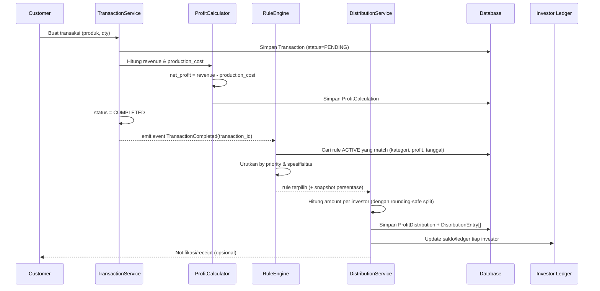

# Study Case: Dynamic Profit-Sharing System untuk Aplikasi Transaksi

## 📌 Studi Kasus (Asli)

> Studi kasus yang digunakan adalah sebuah aplikasi transaksi di mana perusahaan menjual produk kepada pelanggan. Setiap transaksi menghasilkan pendapatan yang kemudian dikurangi dengan biaya produksi untuk mendapatkan keuntungan bersih. Keuntungan tersebut tidak langsung dibagikan dengan persentase tetap, melainkan menggunakan skema pembagian keuntungan yang bersifat dinamis. Administrator dapat mengatur aturan pembagian keuntungan, misalnya berdasarkan jenis produk, besar keuntungan, periode tertentu, atau persentase yang berbeda untuk setiap investor. Setelah transaksi selesai dan keuntungan bersih dihitung, sistem secara otomatis mendistribusikan keuntungan kepada seluruh investor sesuai aturan yang sedang berlaku. Dengan mekanisme ini, perubahan skema pembagian keuntungan dapat dilakukan kapan saja tanpa memengaruhi proses transaksi yang telah berjalan, sehingga sistem menjadi lebih fleksibel dan mudah disesuaikan dengan kebutuhan bisnis.

Dokumen ini membedah studi kasus di atas menjadi kebutuhan yang jelas, lalu menstrukturkannya menjadi rancangan solusi (domain model, arsitektur, alur proses, skema data, hingga API) yang siap diimplementasikan.

---

## 1. Dekomposisi Masalah

Memecah narasi studi kasus menjadi pernyataan kebutuhan yang lebih atomik:

| # | Pernyataan dalam studi kasus | Kebutuhan sistem |
|---|---|---|
| 1 | "menjual produk kepada pelanggan" | Sistem punya entitas **Product**, **Customer**, **Transaction** |
| 2 | "transaksi menghasilkan pendapatan... dikurangi biaya produksi... keuntungan bersih" | Perlu formula: `net_profit = revenue - production_cost` per transaksi |
| 3 | "tidak langsung dibagikan dengan persentase tetap... skema dinamis" | Aturan pembagian **tidak boleh hardcode**, harus data-driven |
| 4 | "Administrator dapat mengatur aturan... jenis produk, besar keuntungan, periode tertentu, persentase berbeda per investor" | Butuh **Rule Engine** dengan multi-kriteria: `product_type`, `profit_range`, `date_period`, `investor_percentage` |
| 5 | "sistem secara otomatis mendistribusikan keuntungan kepada seluruh investor sesuai aturan yang sedang berlaku" | Perlu proses **otomatis** (event-driven) yang mencari rule aktif lalu membuat catatan distribusi |
| 6 | "perubahan skema dapat dilakukan kapan saja tanpa memengaruhi proses transaksi yang telah berjalan" | Rule harus **immutable/versioned** — perubahan rule baru tidak boleh mengubah distribusi transaksi lama (harus di-snapshot) |

### Pertanyaan implisit yang harus dijawab desain
- Apa yang terjadi kalau ada **lebih dari satu rule yang cocok** untuk satu transaksi? → butuh mekanisme **prioritas/spesifisitas**.
- Apa yang terjadi kalau **tidak ada rule yang cocok**? → butuh **fallback/default rule**.
- Bagaimana memastikan total persentase antar investor **tidak melebihi 100%**?
- Bagaimana menangani **rounding** uang (pembagian desimal) agar total distribusi = net profit persis?
- Bagaimana audit trail-nya — kenapa investor X dapat Rp Y dari transaksi Z?

---

## 2. Domain Model (Entitas Inti)

```
Product            → produk yang dijual, punya category/type
Customer           → pembeli
Transaction         → 1 transaksi penjualan (product + customer + qty + revenue + cost)
ProfitCalculation    → hasil hitung net_profit dari 1 transaksi (turunan/anak dari Transaction)
Investor            → pemilik saham keuntungan
ProfitSharingRule    → aturan pembagian (kondisi + daftar persentase per investor), punya validity period
RuleCondition        → kriteria rule: product_type, min/max profit, date range
RuleInvestorShare    → persentase per investor di dalam satu rule
ProfitDistribution    → hasil eksekusi: snapshot pembagian aktual untuk 1 transaksi (child: DistributionEntry per investor)
DistributionEntry     → baris per investor: amount, percentage_used, rule_id (referensi rule yang dipakai saat itu)
```

### Kenapa perlu `ProfitDistribution` sebagai snapshot terpisah dari `ProfitSharingRule`?

Ini poin paling krusial dari studi kasus (poin ke-6 di tabel atas): **rule bisa berubah kapan saja, tapi transaksi lama tidak boleh berubah hasilnya.**

Solusinya: `ProfitDistribution` **tidak** menyimpan referensi hidup ke rule yang bisa berubah nilainya — ia menyimpan **copy/snapshot** dari persentase yang dipakai pada saat itu (rule_id + rule_version + percentage yang digunakan). Rule sendiri bersifat **append-only / versioned**, bukan update-in-place.

---

## 3. Rule Engine — Bagian Paling Kompleks

### 3.1 Struktur Rule

Sebuah `ProfitSharingRule` terdiri dari:
- **Scope/kondisi** (kapan rule ini berlaku):
  - `product_category` (nullable → berarti berlaku untuk semua kategori)
  - `min_profit`, `max_profit` (nullable → tidak dibatasi)
  - `effective_from`, `effective_to` (periode berlaku)
  - `priority` (angka, dipakai saat >1 rule cocok)
- **Perilaku dalam rantai** (bagaimana rule berinteraksi dengan rule lain):
  - `execution_order` — urutan rule dijalankan dalam rantai (kecil = duluan)
  - `stackable` — kalau `false`, rule ini menutup rantai setelah dijalankan
  - `basis` — `GROSS` (persentase dihitung dari net profit awal) atau `RESIDUAL` (dari sisa yang belum dialokasikan)
- **Alokasi** (bagaimana dibagi):
  - list of `{investor_id, percentage}` — total dalam satu rule ≤ 100%; sisa yang tidak teralokasi jatuh ke perusahaan

### 3.2 Rule Matching & Komposisi Berlapis

**Keputusan desain:** satu transaksi bisa tunduk pada **beberapa rule sekaligus**, dijalankan sebagai rantai berlapis. Ini memberi fleksibilitas yang diminta bisnis (misal "rule kategori Elektronik" + "rule bonus periode promo" berlaku bersamaan) tanpa harus membuat rule kombinasi manual untuk setiap kemungkinan.

**Tahap 1 — Matching.** Cari semua rule yang kondisinya terpenuhi:

```
kandidat = SELECT * FROM profit_sharing_rules
           WHERE status = 'ACTIVE'
             AND (product_category IS NULL OR product_category = transaksi.product.category)
             AND (min_profit IS NULL OR net_profit >= min_profit)
             AND (max_profit IS NULL OR net_profit <= max_profit)
             AND transaksi.completed_at BETWEEN effective_from AND COALESCE(effective_to, 'infinity')
ORDER BY execution_order ASC, priority DESC, spesifisitas DESC, created_at DESC
```

**Tahap 2 — Eksekusi berlapis.** Net profit mengalir melewati rantai rule terurut. Setiap rule mengambil porsinya, sisanya diteruskan ke rule berikutnya:

```
sisa = net_profit
alokasi = []

untuk setiap rule dalam kandidat:
    jika sisa <= 0: berhenti
    basis = (rule.basis == GROSS) ? net_profit : sisa

    untuk setiap share dalam rule.shares:
        jumlah = basis × share.percentage
        alokasi.tambah({investor, jumlah, rule, lapisan})

    terpakai = total alokasi dari rule ini
    jika terpakai > sisa: clamp ke sisa + tandai over_allocation
    sisa -= terpakai

    jika bukan rule.stackable: berhenti     ← rule penutup

retained_by_company = sisa                   ← termasuk sisa pembulatan
```

Yang membuat model ini layak dipakai: **satu mekanisme melayani tiga kebutuhan sekaligus.** Rule tunggal dengan `stackable = false` berperilaku persis seperti *winner-takes-all*; beberapa rule `stackable` menghasilkan komposisi berlapis; campuran keduanya memberi mode hybrid. Naik ke skema yang lebih fleksibel nanti tidak butuh migrasi — cukup mengubah data.

Jika **tidak ada rule cocok** → pakai `DEFAULT_RULE` sistem (100% retained ke perusahaan) dan tandai distribusi dengan `is_fallback = true`, sehingga muncul di dashboard admin sebagai "perlu ditinjau". Profit tidak pernah hilang, tapi juga tidak pernah terbagi diam-diam tanpa aturan yang disengaja.

### 3.3 Pagar Pengaman Komposisi

Rule berlapis membuka kelas kesalahan yang tidak ada pada model rule tunggal. Empat pagar yang wajib ada:

| Risiko | Pagar |
|---|---|
| Total alokasi melebihi net profit | Clamp ke sisa yang tersedia + tandai `over_allocation` + munculkan peringatan di dashboard |
| Rantai terlalu panjang / tak terduga | Batas keras 10 lapisan per distribusi |
| Admin tidak sadar rule barunya menumpuk dengan rule lain | **Wajib** tampilkan pratinjau rantai (simulasi) sebelum rule diaktifkan |
| Hasil tidak bisa dijelaskan | Setiap lapisan dicatat terpisah: rule apa, basis berapa, ambil berapa |

### 3.4 Validasi Saat Admin Membuat/Mengubah Rule
- Total persentase investor dalam 1 rule ≤ 100%.
- Sistem menghitung **rule mana saja yang akan tumpang tindih** dengan rule baru, lalu menampilkan hasil simulasi rantainya — ini pencegahan utama, bukan sekadar validasi format.
- Rule baru tidak mengedit rule lama, tapi membuat versi baru (rule lama di-set `effective_to = now()` lalu rule baru mulai dari situ) — ini yang menjamin poin ke-6 studi kasus.

---

## 4. Alur Proses End-to-End (Sequence)



Poin desain penting: **distribusi dipicu oleh event `TransactionCompleted`, bukan dipanggil langsung secara synchronous** di controller transaksi. Ini memisahkan concern "menjual produk" dari "membagi profit", sesuai kalimat studi kasus "sistem secara otomatis mendistribusikan" — dan membuat proses distribusi bisa di-retry/di-reprocess tanpa mengganggu transaksi jual-beli itu sendiri.

---

## 5. Skema Data (ERD Ringkas)

```
Product (id, name, category, production_cost, price)
Customer (id, name, ...)

Transaction (
  id, customer_id, product_id, quantity,
  revenue, production_cost_total, net_profit,
  status, completed_at
)

Investor (id, name, status)

ProfitSharingRule (
  id, name, product_category (nullable),
  min_profit (nullable), max_profit (nullable),
  effective_from, effective_to (nullable),
  priority, specificity,
  execution_order, stackable, basis[GROSS|RESIDUAL],
  status[ACTIVE|SUPERSEDED],
  created_at, created_by
)

RuleInvestorShare (
  id, rule_id (FK), investor_id (FK), percentage
)

ProfitDistribution (
  id, transaction_id (FK, unique),
  net_profit, total_distributed, retained_by_company,
  is_fallback, over_allocation,
  status[CALCULATED|PENDING_APPROVAL|SETTLED|REVERSED],
  distributed_at
)

DistributionLayer (                    ← lapisan rantai rule
  id, distribution_id (FK), layer_index,
  rule_id (FK), rule_snapshot (JSONB),
  basis_amount, allocated_amount
)

DistributionEntry (
  id, layer_id (FK), investor_id (FK),
  percentage_applied, amount
)
```

**Relasi kunci:**
- `Transaction 1—1 ProfitDistribution` (satu transaksi hanya didistribusikan sekali; idempotent by unique constraint pada `transaction_id`).
- `ProfitDistribution 1—N DistributionLayer` (satu baris per rule dalam rantai).
- `DistributionLayer 1—N DistributionEntry` (satu baris per investor dalam lapisan itu).
- `ProfitSharingRule 1—N RuleInvestorShare` (definisi persentase per investor dalam rule).

Lapisan `DistributionLayer` adalah konsekuensi langsung dari keputusan composable rule. Tanpa entitas ini, hasil distribusi berlapis hanya berupa daftar angka tanpa jejak: mustahil menjawab *"porsi investor A yang Rp 2 juta ini datang dari rule yang mana?"*.

---

## 6. Penanganan Edge Case

| Edge case | Penanganan |
|---|---|
| Rule diubah **setelah** transaksi lama selesai | Tidak berdampak — setiap `DistributionLayer` menyimpan `rule_snapshot` pada saat distribusi terjadi, bukan referensi live. |
| Beberapa rule cocok bersamaan | Bukan konflik lagi — semuanya dijalankan berlapis sesuai `execution_order`. Urutan tetap deterministik lewat `execution_order` → `priority` → spesifisitas → `created_at`. |
| Rantai rule mengalokasikan lebih dari 100% | Clamp ke sisa yang tersedia, tandai `over_allocation = true`, munculkan peringatan di dashboard. Distribusi tetap jalan — profit tidak pernah tersangkut. |
| Tidak ada rule cocok | Pakai default rule (100% retained ke perusahaan), tandai `is_fallback = true` agar masuk daftar tinjauan admin. |
| Pembulatan (net_profit tidak habis dibagi rata) | Hitung tiap investor dengan pembulatan ke bawah pada satuan terkecil; seluruh sisa pembulatan jatuh ke perusahaan — sehingga `SUM(entry) + retained == net_profit` **persis**, tanpa selisih sepeser pun. |
| Distribusi diproses dua kali (retry event) | Idempotency lewat unique constraint `transaction_id` di `ProfitDistribution` + `Idempotency-Key` di lapisan API. |
| Transaksi dibatalkan/refund setelah distribusi jalan | Alur **reversal**: buat distribusi baru bertipe `REVERSAL` yang menegasikan entry sebelumnya (bukan delete — demi audit trail). |
| Admin mengubah persentase di tengah periode | Tidak mengedit rule lama; sistem menutup rule lama (`effective_to = now`) dan membuat rule baru — histori tetap utuh. |
| Nominal distribusi besar dibiarkan lolos tanpa ditinjau | Distribusi di atas ambang batas masuk status `PENDING_APPROVAL` dan wajib di-*approve*; di bawah ambang, `SETTLED` otomatis. |

---

## 7. Keputusan yang Sudah Difinalkan

Semua ambiguitas dalam narasi studi kasus sudah diklarifikasi (rincian lengkap beserta alasannya ada di [`open-q.md`](./open-q.md)). Ringkasan yang berdampak langsung pada desain:

| Topik | Keputusan |
|---|---|
| Komposisi rule | **Composable berlapis** — beberapa rule bisa berlaku bersamaan, dijalankan berurutan; siap naik ke mode hybrid tanpa migrasi |
| Total persentase | Boleh ≤ 100%; sisanya jadi *retained earnings* perusahaan |
| Tidak ada rule cocok | Default rule + penanda `is_fallback` untuk ditinjau admin |
| Daftar investor | Berbeda-beda per rule (fleksibel penuh) |
| Approval | Berbasis ambang batas: nominal kecil otomatis final, nominal besar wajib disetujui |
| Siklus distribusi | Pencatatan ledger real-time per transaksi; **pencairan** dijadwalkan per periode |
| Sisa pembulatan | Ke akun perusahaan |
| Refund | Entri `REVERSAL`, tidak pernah menghapus atau mengubah data lama |
| Mata uang | IDR tunggal, disimpan sebagai integer satuan terkecil |

---

## 8. Ringkasan Arsitektur Solusi

- **Pattern**: Composable Rule Engine (pipeline berlapis) + Event-Driven distribution + Append-only versioning untuk rule dan ledger.
- **Prinsip utama**: *Snapshot-at-execution-time* — hasil distribusi tidak pernah bergantung pada state rule yang bisa berubah di masa depan.
- **Modul**:
  1. `Transaction Module` — CRUD transaksi & hitung net profit.
  2. `Rule Management Module` — CRUD rule oleh admin (versioning, bukan *update in-place*) + simulator.
  3. `Distribution Engine` — listener yang menjalankan rantai rule, membagi profit, dan mencatat snapshot per lapisan.
  4. `Investor Ledger Module` — mutasi *append-only* per investor + penjadwalan pencairan periodik.
- **Integrasi**: Distribution Engine dipicu via domain event (`TransactionCompleted`) yang diterbitkan lewat pola *outbox*, bukan panggilan langsung — agar tidak ada transaksi tercatat yang profitnya gagal terbagi.

> Rancangan teknis lengkap (framework, struktur folder, skema database, API) ada di [`architecture.md`](./architecture.md). Rancangan antarmuka ada di [`design.md`](./design.md).
